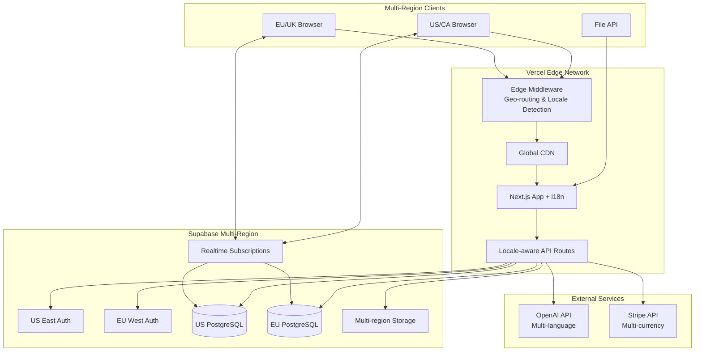
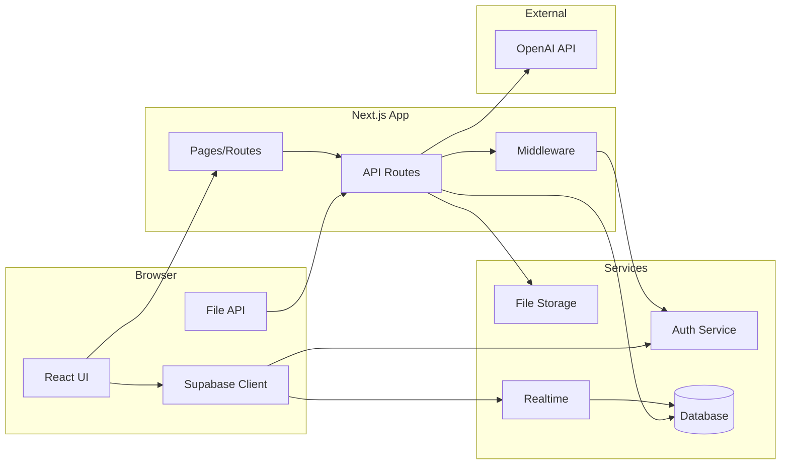
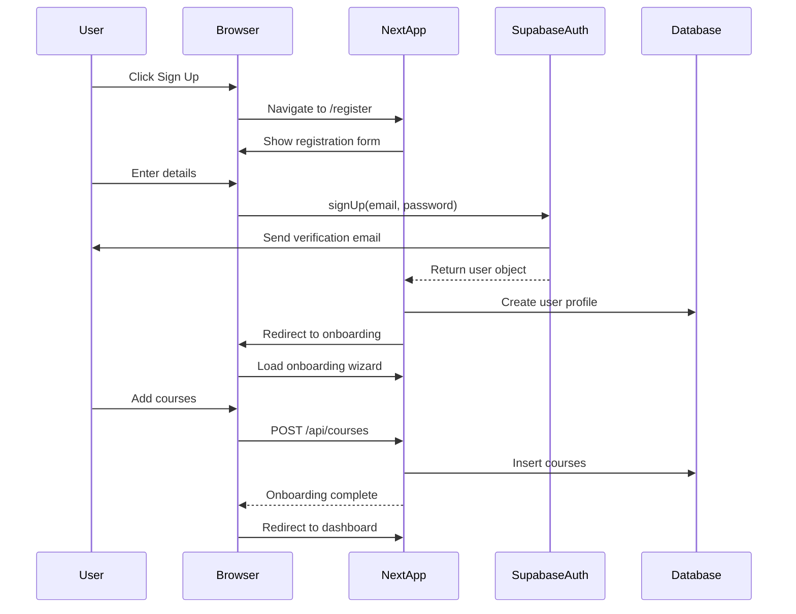
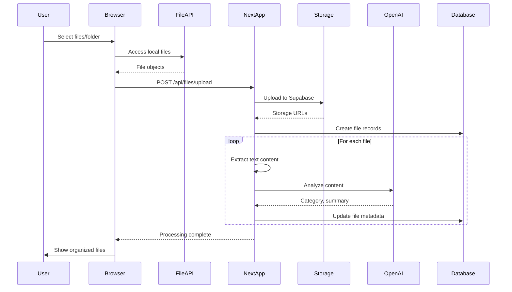
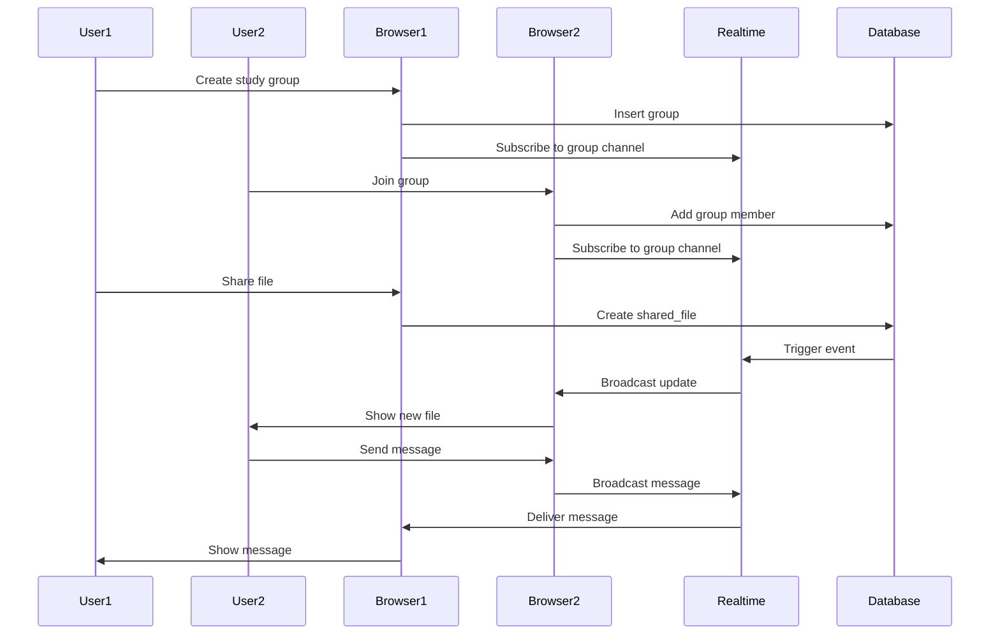
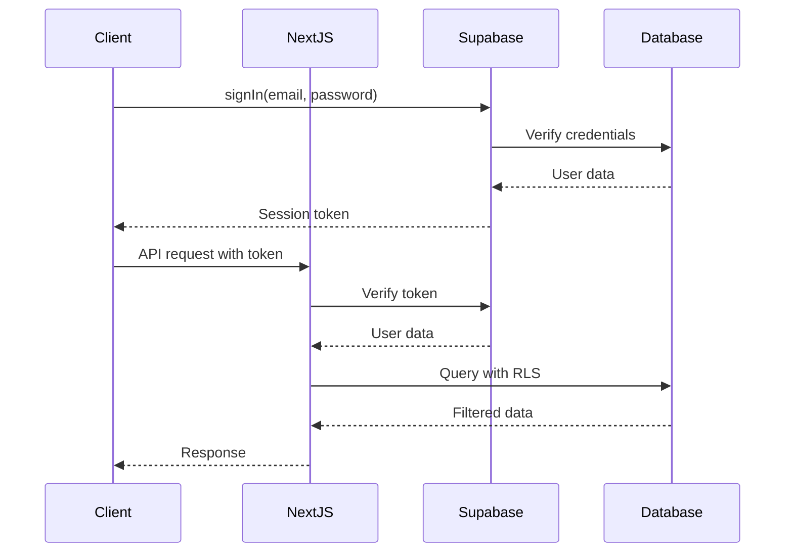
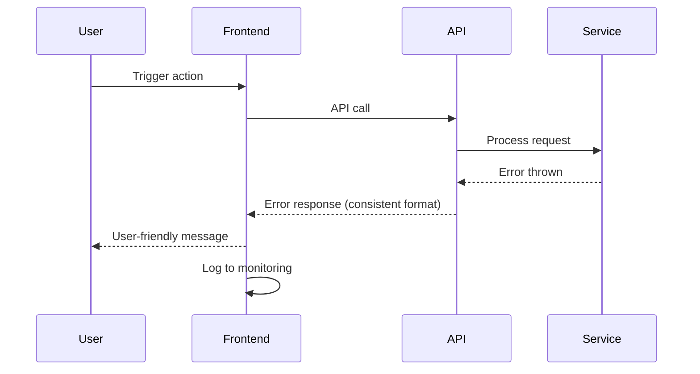

# CourseFlow Multi-Regional Fullstack Architecture Document

## Introduction

This document outlines the complete fullstack architecture for CourseFlow, a multi-regional academic file organization platform serving students across North America (US, Canada) and Europe (EU, UK). It serves as the single source of truth for AI-driven development, focusing on a minimal tech stack of 7 core components (including payment processing and internationalization) that deliver maximum value with minimal complexity.

This architecture prioritizes rapid development, maintainability, and exceptional user experience while supporting multiple languages, currencies, and academic systems across different regions.

### Starter Template or Existing Project
N/A - Greenfield project built from scratch using Next.js 14 App Router

### Change Log
| Date | Version | Description | Author |
|------|---------|-------------|--------|
| 2025-01-27 | 1.0 | Initial simplified architecture | Winston |
| 2025-01-27 | 2.0 | Added multi-regional support and localization | Winston |

## High Level Architecture

### Technical Summary
CourseFlow uses a monolithic Next.js 14 application with internationalization support deployed across multiple Vercel regions, leveraging Supabase as a complete backend-as-a-service solution. The architecture follows the Jamstack pattern with locale-aware server-side rendering for optimal performance, while API routes handle all backend logic including OpenAI integration for multilingual AI features. Authentication, database, file storage, and real-time features are all managed through Supabase with multi-region replication. The system supports 4+ languages (English, French, German, Spanish), multiple currencies (USD, CAD, EUR, GBP), and diverse academic systems (GPA, ECTS, UK Honours). This approach enables rapid development while serving a total addressable market of ~50 million students across target regions.

### Platform and Infrastructure Choice
**Platform:** Vercel + Supabase  
**Key Services:** 
- Vercel: Hosting, CDN, Edge Functions, Analytics
- Supabase: PostgreSQL, Auth, Storage, Realtime
- Stripe: Payment processing, subscription management
- OpenAI API: GPT-3.5/4 for AI features
**Deployment Host and Regions:** 
- Primary: Vercel Global Edge Network with regional deployments
- US East (Virginia) - Primary for North America
- EU West (Frankfurt) - Primary for Europe
- Edge middleware for geo-routing and locale detection
- Supabase regions aligned with Vercel deployments

### Repository Structure
**Structure:** Monorepo using npm workspaces  
**Monorepo Tool:** npm workspaces (built into npm 7+)  
**Package Organization:** Single Next.js app with shared types package

### High Level Architecture Diagram


### Architectural Patterns
- **Jamstack Architecture:** Static generation with dynamic API routes - *Rationale:* Optimal performance and SEO for content-heavy academic platform
- **Monolithic Deployment:** Single Next.js app handles everything - *Rationale:* Drastically reduces complexity for 10-week MVP timeline
- **Backend-for-Frontend (BFF):** API routes tailored for frontend needs - *Rationale:* Eliminates over-fetching and simplifies state management
- **Component-Based UI:** Reusable React components with TypeScript - *Rationale:* Rapid development with type safety
- **Server Components:** React Server Components for data fetching - *Rationale:* Reduces client bundle size and improves performance
- **Row Level Security:** Database-level access control - *Rationale:* Security enforced at data layer, not application layer
- **Multi-Region Deployment:** Separate deployments for NA and EU - *Rationale:* Data residency compliance and performance
- **Locale-First Routing:** All routes prefixed with locale - *Rationale:* SEO optimization and user experience

## Localization Architecture

### Supported Regions & Languages

#### North America
- **Markets:** United States, Canada
- **Languages:** English (en-US), French (fr-CA)
- **Currencies:** USD, CAD
- **Academic Systems:** GPA (4.0), Letter grades
- **Date Format:** MM/DD/YYYY
- **Deployment Region:** US East (Virginia)

#### Europe
- **Markets:** EU countries, United Kingdom
- **Languages:** English (en-GB), German (de), French (fr), Spanish (es)
- **Currencies:** EUR, GBP
- **Academic Systems:** ECTS, UK Honours
- **Date Format:** DD/MM/YYYY
- **Deployment Region:** EU West (Frankfurt)

### i18n Implementation Strategy

1. **Routing:** `/[locale]/path` structure for all pages
2. **API Routes:** `/api/[locale]/endpoint` for locale-aware responses
3. **Content:** Translation keys stored in JSON files and database
4. **AI Responses:** Locale-specific prompts for OpenAI
5. **Currency:** Automatic conversion based on user location
6. **Academic Terms:** Dynamic terminology based on region

## Tech Stack

This is the DEFINITIVE technology selection. All development must use these exact versions.

### Technology Stack Table
| Category | Technology | Version | Purpose | Rationale |
|----------|------------|---------|---------|-----------|
| Frontend Language | TypeScript | 5.3+ | Type-safe development | Catch errors early, better DX |
| Frontend Framework | Next.js | 14.1+ | Full-stack React framework | Single framework for entire app |
| UI Component Library | Shadcn/ui | Latest | Beautiful, accessible components | Rapid UI development |
| State Management | Zustand | 4.5+ | Lightweight state management | Simple, no boilerplate |
| Backend Language | TypeScript | 5.3+ | Unified language | Same as frontend |
| Backend Framework | Next.js API Routes | 14.1+ | Serverless API endpoints | Built into Next.js |
| API Style | REST | - | Simple HTTP APIs | No GraphQL complexity |
| Database | PostgreSQL | 15+ | Relational data | Via Supabase |
| Cache | Vercel Edge Cache | - | CDN caching | Automatic with Vercel |
| File Storage | Supabase Storage | - | User file storage | Integrated with auth |
| Authentication | Supabase Auth | 2.0+ | Complete auth solution | Email, OAuth, magic links |
| Frontend Testing | Vitest | 1.2+ | Unit testing | Fast, Jest-compatible |
| Backend Testing | Vitest | 1.2+ | API testing | Same as frontend |
| E2E Testing | Playwright | 1.41+ | Browser automation | Reliable, fast |
| Build Tool | Next.js | 14.1+ | Built-in build system | Zero config |
| Bundler | Webpack/Turbopack | Built-in | Via Next.js | Automatic optimization |
| IaC Tool | N/A | - | Not needed | Vercel handles infra |
| CI/CD | GitHub Actions | - | Automated deployment | Free for public repos |
| Monitoring | Vercel Analytics | - | Performance monitoring | Built into platform |
| Logging | Vercel Logs | - | Centralized logging | Automatic with Vercel |
| CSS Framework | Tailwind CSS | 3.4+ | Utility-first CSS | Rapid styling |
| i18n Framework | next-intl | 3.0+ | Internationalization | Type-safe translations |
| Payment Processing | Stripe | Latest | Multi-currency billing | Global payment support |

## Data Models

### User
**Purpose:** Core user account and profile information with regional preferences

**Key Attributes:**
- id: UUID - Unique identifier from Supabase Auth
- email: string - User's email address
- full_name: string - Display name
- university: string - Institution name
- preferred_locale: string - User's language preference (en-US, fr-CA, etc.)
- country: string - User's country code
- timezone: string - User's timezone
- academic_system: enum - Grading system (gpa, ects, uk_honours)
- created_at: timestamp - Account creation
- avatar_url: string - Profile picture URL

**TypeScript Interface:**
```typescript
interface User {
  id: string;
  email: string;
  full_name: string;
  university?: string;
  preferred_locale: string;
  country: string;
  timezone: string;
  academic_system: 'gpa' | 'ects' | 'uk_honours' | 'percentage';
  created_at: Date;
  avatar_url?: string;
}
```

**Relationships:**
- Has many Courses
- Has many Files
- Has many StudySessions
- Belongs to many Groups

### Course
**Purpose:** Academic course/module organization with regional adaptations

**Key Attributes:**
- id: UUID - Unique identifier
- user_id: UUID - Owner of the course
- name: string - Course name (localized)
- code: string - Course code
- professor: string - Instructor name
- term: string - Academic period (semester/term/trimester)
- academic_period_type: enum - Period type by region
- credits: number - US/Canada credit hours
- ects_credits: number - European ECTS credits
- color: string - UI color for visual organization
- emoji: string - Visual identifier

**TypeScript Interface:**
```typescript
interface Course {
  id: string;
  user_id: string;
  name: string;
  code?: string;
  professor?: string;
  term: string;
  academic_period_type: 'semester' | 'term' | 'trimester';
  credits?: number;
  ects_credits?: number;
  color: string;
  emoji?: string;
  created_at: Date;
  updated_at: Date;
}
```

**Relationships:**
- Belongs to User
- Has many Files

### File
**Purpose:** Uploaded academic files with AI-enhanced multilingual metadata

**Key Attributes:**
- id: UUID - Unique identifier
- user_id: UUID - File owner
- course_id: UUID - Associated course
- original_name: string - Original filename
- display_name: string - AI-improved name
- storage_url: string - Supabase Storage URL
- file_type: string - MIME type
- file_size: bigint - Size in bytes
- detected_language: string - Content language
- ai_category: string - AI-determined category
- ai_summary: text - AI-generated summary (in user's language)
- ai_summary_translations: jsonb - Translations of summary
- ai_confidence: float - Categorization confidence

**TypeScript Interface:**
```typescript
interface File {
  id: string;
  user_id: string;
  course_id?: string;
  original_name: string;
  display_name: string;
  storage_url: string;
  file_type: string;
  file_size: number;
  detected_language?: string;
  ai_category?: 'lecture' | 'assignment' | 'notes' | 'exam' | 'other';
  ai_summary?: string;
  ai_summary_translations?: Record<string, string>;
  ai_confidence?: number;
  created_at: Date;
  processed_at?: Date;
}
```

**Relationships:**
- Belongs to User
- Belongs to Course
- Has many Annotations
- Has many Flashcards

### StudySession
**Purpose:** Track study time and progress

**Key Attributes:**
- id: UUID - Unique identifier
- user_id: UUID - Student
- file_id: UUID - File being studied
- course_id: UUID - Related course
- duration: integer - Minutes studied
- notes: text - Session notes
- started_at: timestamp - Session start
- ended_at: timestamp - Session end

**TypeScript Interface:**
```typescript
interface StudySession {
  id: string;
  user_id: string;
  file_id?: string;
  course_id?: string;
  duration: number;
  notes?: string;
  started_at: Date;
  ended_at?: Date;
}
```

**Relationships:**
- Belongs to User
- Belongs to File (optional)
- Belongs to Course (optional)

### Group
**Purpose:** Collaborative study groups with language preferences

**Key Attributes:**
- id: UUID - Unique identifier
- name: string - Group name
- description: text - Group purpose
- created_by: UUID - Creator user ID
- is_public: boolean - Public/private flag
- max_members: integer - Member limit
- primary_language: string - Main group language
- allowed_languages: array - Supported languages
- settings: jsonb - Group preferences

**TypeScript Interface:**
```typescript
interface Group {
  id: string;
  name: string;
  description?: string;
  created_by: string;
  is_public: boolean;
  max_members: number;
  primary_language: string;
  allowed_languages: string[];
  settings: {
    allow_file_sharing: boolean;
    allow_chat: boolean;
    require_approval: boolean;
  };
  created_at: Date;
}
```

**Relationships:**
- Has many GroupMembers
- Has many SharedFiles
- Has many ChatMessages

### Subscription
**Purpose:** Track user subscription status and multi-currency billing

**Key Attributes:**
- id: UUID - Unique identifier
- user_id: UUID - Subscriber
- tier: enum - Subscription level (free, student, premium)
- status: enum - Status (trialing, active, canceled, past_due)
- currency: string - Billing currency (USD, CAD, EUR, GBP)
- country_code: string - Billing country
- stripe_subscription_id: string - Stripe reference
- stripe_customer_id: string - Stripe customer
- current_period_start: timestamp - Billing period start
- current_period_end: timestamp - Billing period end

**TypeScript Interface:**
```typescript
interface Subscription {
  id: string;
  user_id: string;
  tier: 'free' | 'student' | 'premium';
  status: 'trialing' | 'active' | 'canceled' | 'past_due';
  currency: 'USD' | 'CAD' | 'EUR' | 'GBP';
  country_code: string;
  stripe_subscription_id?: string;
  stripe_customer_id: string;
  current_period_start: Date;
  current_period_end: Date;
  created_at: Date;
  updated_at: Date;
}
```

**Relationships:**
- Belongs to User
- Has many UsageTracking records

## API Specification

### REST API Specification
```yaml
openapi: 3.0.0
info:
  title: CourseFlow API
  version: 1.0.0
  description: REST API for CourseFlow academic file organization
servers:
  - url: https://api.CourseFlow.app/{locale}
    description: Production API
    variables:
      locale:
        default: en-US
        enum: [en-US, en-GB, fr-CA, fr, de, es]

paths:
  # Auth handled by Supabase directly
  
  /{locale}/api/courses:
    get:
      summary: Get user's courses
      security:
        - BearerAuth: []
      responses:
        200:
          description: List of courses
          content:
            application/json:
              schema:
                type: array
                items:
                  $ref: '#/components/schemas/Course'
    
    post:
      summary: Create new course
      security:
        - BearerAuth: []
      requestBody:
        required: true
        content:
          application/json:
            schema:
              $ref: '#/components/schemas/CourseInput'
      responses:
        201:
          description: Created course
          
  /{locale}/api/files/upload:
    post:
      summary: Upload files
      security:
        - BearerAuth: []
      requestBody:
        required: true
        content:
          multipart/form-data:
            schema:
              type: object
              properties:
                files:
                  type: array
                  items:
                    type: string
                    format: binary
                course_id:
                  type: string
      responses:
        201:
          description: Upload results
          
  /api/files/categorize:
    post:
      summary: AI categorization
      security:
        - BearerAuth: []
      requestBody:
        required: true
        content:
          application/json:
            schema:
              type: object
              properties:
                file_ids:
                  type: array
                  items:
                    type: string
      responses:
        200:
          description: Categorization results
          
  /{locale}/api/study/summary:
    post:
      summary: Generate AI summary in user's language
      security:
        - BearerAuth: []
      requestBody:
        required: true
        content:
          application/json:
            schema:
              type: object
              properties:
                file_id:
                  type: string
                length:
                  type: string
                  enum: [brief, standard, detailed]
      responses:
        200:
          description: Generated summary
          
  /api/groups:
    get:
      summary: Get user's groups
      security:
        - BearerAuth: []
      responses:
        200:
          description: List of groups
    
    post:
      summary: Create study group
      security:
        - BearerAuth: []
      requestBody:
        required: true
        content:
          application/json:
            schema:
              $ref: '#/components/schemas/GroupInput'
      responses:
        201:
          description: Created group
          
  /{locale}/api/billing/create-checkout:
    post:
      summary: Create Stripe checkout session with local currency
      security:
        - BearerAuth: []
      requestBody:
        required: true
        content:
          application/json:
            schema:
              type: object
              properties:
                tier:
                  type: string
                  enum: [student, premium]
                annual:
                  type: boolean
                currency:
                  type: string
                  enum: [USD, CAD, EUR, GBP]
      responses:
        200:
          description: Checkout session URL
          
  /{locale}/api/grades/convert:
    post:
      summary: Convert grades between academic systems
      security:
        - BearerAuth: []
      requestBody:
        required: true
        content:
          application/json:
            schema:
              type: object
              properties:
                grade:
                  type: string
                from_system:
                  type: string
                  enum: [gpa, ects, uk_honours, percentage]
                to_system:
                  type: string
                  enum: [gpa, ects, uk_honours, percentage]
      responses:
        200:
          description: Converted grade
          
  /{locale}/api/locale/preferences:
    get:
      summary: Get user locale preferences
      security:
        - BearerAuth: []
      responses:
        200:
          description: User preferences
    put:
      summary: Update user locale preferences
      security:
        - BearerAuth: []
      requestBody:
        required: true
        content:
          application/json:
            schema:
              type: object
              properties:
                preferred_locale:
                  type: string
                timezone:
                  type: string
                academic_system:
                  type: string
      responses:
        200:
          description: Updated preferences
          
  /api/billing/portal:
    post:
      summary: Create customer portal session
      security:
        - BearerAuth: []
      responses:
        200:
          description: Portal URL
          
  /api/billing/usage:
    get:
      summary: Get current usage and limits
      security:
        - BearerAuth: []
      responses:
        200:
          description: Usage data

components:
  securitySchemes:
    BearerAuth:
      type: http
      scheme: bearer
      bearerFormat: JWT
```

## Components

### Frontend Application
**Responsibility:** User interface, file upload handling, real-time updates, state management

**Key Interfaces:**
- File upload with progress tracking
- Real-time collaboration features
- AI result display and interaction
- Study session management

**Dependencies:** Supabase client SDK, OpenAI responses via API

**Technology Stack:** Next.js 14, React 18, TypeScript, Tailwind CSS, Shadcn/ui

### API Routes Layer
**Responsibility:** Backend logic, AI integration, data processing, file handling

**Key Interfaces:**
- REST endpoints for all operations
- File processing pipeline
- OpenAI API integration
- Supabase service calls

**Dependencies:** Supabase Admin SDK, OpenAI SDK, file parsing libraries

**Technology Stack:** Next.js API Routes, TypeScript, Node.js runtime

### Authentication Service
**Responsibility:** User authentication, session management, access control

**Key Interfaces:**
- Email/password auth
- OAuth providers (Google, GitHub)
- Magic link authentication
- Session validation

**Dependencies:** Supabase Auth

**Technology Stack:** Supabase Auth with Row Level Security

### File Storage Service
**Responsibility:** Secure file storage, access control, CDN delivery

**Key Interfaces:**
- Direct file uploads from browser
- Presigned URLs for secure access
- File metadata management
- Storage quotas

**Dependencies:** Supabase Storage

**Technology Stack:** Supabase Storage with S3-compatible API

### AI Processing Service
**Responsibility:** File categorization, summary generation, flashcard creation

**Key Interfaces:**
- Text extraction from documents
- Content analysis and categorization
- Summary generation with different lengths
- Flashcard generation from content

**Dependencies:** OpenAI API, pdf-parse, mammoth (DOCX parsing)

**Technology Stack:** OpenAI GPT-3.5/4, Next.js API routes

### Real-time Collaboration
**Responsibility:** Live updates, chat, shared whiteboards, presence

**Key Interfaces:**
- WebSocket connections
- Channel subscriptions
- Presence tracking
- Message broadcasting

**Dependencies:** Supabase Realtime

**Technology Stack:** Supabase Realtime with PostgreSQL triggers

### Payment Processing Service
**Responsibility:** Subscription management, payment processing, usage tracking

**Key Interfaces:**
- Checkout session creation
- Subscription status verification
- Usage limit enforcement
- Webhook handling for Stripe events

**Dependencies:** Stripe API, Supabase for storage

**Technology Stack:** Stripe SDK, Next.js API routes, PostgreSQL for subscription data

### Component Diagrams


## External APIs

### OpenAI API
- **Purpose:** AI-powered file categorization, content analysis, summary and flashcard generation
- **Documentation:** https://platform.openai.com/docs
- **Base URL(s):** https://api.openai.com/v1
- **Authentication:** Bearer token (API key)
- **Rate Limits:** 10,000 TPM (tokens per minute) for GPT-3.5-turbo

**Key Endpoints Used:**
- `POST /chat/completions` - All AI operations using chat format

**Integration Notes:** Use streaming for long responses, implement retry logic with exponential backoff, cache results to minimize API calls

## Core Workflows

### User Registration and Onboarding


### File Upload and AI Processing


### Real-time Collaboration


## Database Schema

### SQL Schema Definition
```sql
-- Users table managed by Supabase Auth
-- Additional user profile data with localization
CREATE TABLE user_profiles (
  id UUID PRIMARY KEY REFERENCES auth.users(id),
  full_name TEXT,
  university TEXT,
  avatar_url TEXT,
  preferred_locale TEXT DEFAULT 'en-US',
  country TEXT NOT NULL,
  timezone TEXT NOT NULL DEFAULT 'UTC',
  academic_system TEXT CHECK (academic_system IN ('gpa', 'ects', 'uk_honours', 'percentage')),
  created_at TIMESTAMPTZ DEFAULT NOW(),
  updated_at TIMESTAMPTZ DEFAULT NOW()
);

-- Courses table with regional academic support
CREATE TABLE courses (
  id UUID PRIMARY KEY DEFAULT gen_random_uuid(),
  user_id UUID REFERENCES auth.users(id) ON DELETE CASCADE,
  name TEXT NOT NULL,
  code TEXT,
  professor TEXT,
  term TEXT NOT NULL,
  academic_period_type TEXT CHECK (academic_period_type IN ('semester', 'term', 'trimester')),
  credits INTEGER, -- US/Canada credits
  ects_credits INTEGER, -- European ECTS
  color TEXT NOT NULL DEFAULT '#3B82F6',
  emoji TEXT,
  created_at TIMESTAMPTZ DEFAULT NOW(),
  updated_at TIMESTAMPTZ DEFAULT NOW()
);

-- Files table with multilingual support
CREATE TABLE files (
  id UUID PRIMARY KEY DEFAULT gen_random_uuid(),
  user_id UUID REFERENCES auth.users(id) ON DELETE CASCADE,
  course_id UUID REFERENCES courses(id) ON DELETE SET NULL,
  original_name TEXT NOT NULL,
  display_name TEXT NOT NULL,
  storage_url TEXT NOT NULL,
  file_type TEXT NOT NULL,
  file_size BIGINT NOT NULL,
  detected_language TEXT,
  ai_category TEXT CHECK (ai_category IN ('lecture', 'assignment', 'notes', 'exam', 'other')),
  ai_summary TEXT,
  ai_summary_translations JSONB DEFAULT '{}',
  ai_confidence FLOAT CHECK (ai_confidence >= 0 AND ai_confidence <= 1),
  created_at TIMESTAMPTZ DEFAULT NOW(),
  processed_at TIMESTAMPTZ
);

-- Study sessions table
CREATE TABLE study_sessions (
  id UUID PRIMARY KEY DEFAULT gen_random_uuid(),
  user_id UUID REFERENCES auth.users(id) ON DELETE CASCADE,
  file_id UUID REFERENCES files(id) ON DELETE CASCADE,
  course_id UUID REFERENCES courses(id) ON DELETE SET NULL,
  duration INTEGER NOT NULL DEFAULT 0,
  notes TEXT,
  started_at TIMESTAMPTZ DEFAULT NOW(),
  ended_at TIMESTAMPTZ
);

-- Flashcards table with language support
CREATE TABLE flashcards (
  id UUID PRIMARY KEY DEFAULT gen_random_uuid(),
  file_id UUID REFERENCES files(id) ON DELETE CASCADE,
  question TEXT NOT NULL,
  answer TEXT NOT NULL,
  language TEXT NOT NULL DEFAULT 'en',
  times_studied INTEGER DEFAULT 0,
  confidence_score FLOAT DEFAULT 0.5,
  next_review_date TIMESTAMPTZ,
  created_at TIMESTAMPTZ DEFAULT NOW()
);

-- Groups table with language preferences
CREATE TABLE groups (
  id UUID PRIMARY KEY DEFAULT gen_random_uuid(),
  name TEXT NOT NULL,
  description TEXT,
  created_by UUID REFERENCES auth.users(id) ON DELETE CASCADE,
  is_public BOOLEAN DEFAULT false,
  max_members INTEGER DEFAULT 20,
  primary_language TEXT NOT NULL DEFAULT 'en',
  allowed_languages TEXT[] DEFAULT ARRAY['en'],
  settings JSONB DEFAULT '{"allow_file_sharing": true, "allow_chat": true, "require_approval": false}'::jsonb,
  created_at TIMESTAMPTZ DEFAULT NOW()
);

-- Group members table
CREATE TABLE group_members (
  group_id UUID REFERENCES groups(id) ON DELETE CASCADE,
  user_id UUID REFERENCES auth.users(id) ON DELETE CASCADE,
  role TEXT DEFAULT 'member' CHECK (role IN ('owner', 'admin', 'member')),
  joined_at TIMESTAMPTZ DEFAULT NOW(),
  PRIMARY KEY (group_id, user_id)
);

-- Shared files table
CREATE TABLE shared_files (
  id UUID PRIMARY KEY DEFAULT gen_random_uuid(),
  file_id UUID REFERENCES files(id) ON DELETE CASCADE,
  group_id UUID REFERENCES groups(id) ON DELETE CASCADE,
  shared_by UUID REFERENCES auth.users(id) ON DELETE CASCADE,
  shared_at TIMESTAMPTZ DEFAULT NOW()
);

-- Subscriptions table with multi-currency
CREATE TABLE subscriptions (
  id UUID PRIMARY KEY DEFAULT gen_random_uuid(),
  user_id UUID REFERENCES auth.users(id) ON DELETE CASCADE UNIQUE,
  tier TEXT NOT NULL DEFAULT 'free' CHECK (tier IN ('free', 'student', 'premium')),
  status TEXT NOT NULL DEFAULT 'active' CHECK (status IN ('trialing', 'active', 'canceled', 'past_due')),
  currency TEXT NOT NULL CHECK (currency IN ('USD', 'CAD', 'EUR', 'GBP')),
  country_code TEXT NOT NULL,
  stripe_subscription_id TEXT UNIQUE,
  stripe_customer_id TEXT NOT NULL,
  current_period_start TIMESTAMPTZ,
  current_period_end TIMESTAMPTZ,
  created_at TIMESTAMPTZ DEFAULT NOW(),
  updated_at TIMESTAMPTZ DEFAULT NOW()
);

-- Usage tracking table
CREATE TABLE usage_tracking (
  id UUID PRIMARY KEY DEFAULT gen_random_uuid(),
  user_id UUID REFERENCES auth.users(id) ON DELETE CASCADE,
  feature TEXT NOT NULL,
  count INTEGER NOT NULL DEFAULT 0,
  period_start TIMESTAMPTZ NOT NULL,
  period_end TIMESTAMPTZ NOT NULL,
  created_at TIMESTAMPTZ DEFAULT NOW(),
  UNIQUE(user_id, feature, period_start)
);

-- Grades table for tracking different grading systems
CREATE TABLE grades (
  id UUID PRIMARY KEY DEFAULT gen_random_uuid(),
  user_id UUID REFERENCES auth.users(id) ON DELETE CASCADE,
  course_id UUID REFERENCES courses(id) ON DELETE CASCADE,
  grade_value TEXT NOT NULL,
  grade_type TEXT CHECK (grade_type IN ('letter', 'percentage', 'gpa_points', 'ects_grade')),
  academic_period TEXT NOT NULL,
  date_recorded TIMESTAMPTZ DEFAULT NOW(),
  created_at TIMESTAMPTZ DEFAULT NOW()
);

-- Academic terms reference table
CREATE TABLE academic_terms (
  id UUID PRIMARY KEY DEFAULT gen_random_uuid(),
  country TEXT NOT NULL,
  institution_type TEXT,
  term_name TEXT NOT NULL,
  start_month INTEGER NOT NULL,
  end_month INTEGER NOT NULL,
  is_primary_term BOOLEAN DEFAULT false,
  created_at TIMESTAMPTZ DEFAULT NOW()
);

-- Translations table for dynamic content
CREATE TABLE translations (
  id UUID PRIMARY KEY DEFAULT gen_random_uuid(),
  key TEXT NOT NULL,
  locale TEXT NOT NULL,
  value TEXT NOT NULL,
  context TEXT CHECK (context IN ('ui', 'academic', 'email')),
  updated_at TIMESTAMPTZ DEFAULT NOW(),
  UNIQUE(key, locale, context)
);

-- Indexes for performance
CREATE INDEX idx_files_user_course ON files(user_id, course_id);
CREATE INDEX idx_files_created ON files(created_at DESC);
CREATE INDEX idx_study_sessions_user ON study_sessions(user_id);
CREATE INDEX idx_group_members_user ON group_members(user_id);

-- Row Level Security Policies
ALTER TABLE courses ENABLE ROW LEVEL SECURITY;
ALTER TABLE files ENABLE ROW LEVEL SECURITY;
ALTER TABLE study_sessions ENABLE ROW LEVEL SECURITY;

-- Users can only see their own courses
CREATE POLICY "Users can view own courses" ON courses
  FOR SELECT USING (auth.uid() = user_id);

CREATE POLICY "Users can insert own courses" ON courses
  FOR INSERT WITH CHECK (auth.uid() = user_id);

CREATE POLICY "Users can update own courses" ON courses
  FOR UPDATE USING (auth.uid() = user_id);

CREATE POLICY "Users can delete own courses" ON courses
  FOR DELETE USING (auth.uid() = user_id);

-- Similar policies for files and study_sessions...
```

## Regional Deployment Strategy

### Multi-Region Architecture

#### Deployment Regions
1. **North America (Primary)**
   - Vercel: US East (Virginia)
   - Supabase: US East 
   - Serves: US, Canada
   - Expected Latency: <50ms

2. **Europe (Primary)**
   - Vercel: EU West (Frankfurt)
   - Supabase: EU West
   - Serves: EU, UK
   - Expected Latency: <50ms

#### Edge Middleware Configuration
```typescript
// middleware.ts
export async function middleware(request: NextRequest) {
  // Detect user location
  const country = request.geo?.country || 'US';
  const region = request.geo?.region || 'unknown';
  
  // Determine locale
  const locale = getLocaleFromCountry(country);
  
  // Route to appropriate region
  if (isEuropeanCountry(country)) {
    // Route to EU deployment
    request.headers.set('x-region', 'eu-west');
  } else {
    // Route to US deployment
    request.headers.set('x-region', 'us-east');
  }
  
  // Add locale to path
  if (!request.nextUrl.pathname.startsWith(`/${locale}`)) {
    return NextResponse.redirect(
      new URL(`/${locale}${request.nextUrl.pathname}`, request.url)
    );
  }
}
```

#### Data Residency Compliance
- EU users' data stored in EU region (GDPR)
- Canadian users' data can be stored in US (PIPEDA compatible)
- Automatic replication disabled between regions
- User consent required for cross-region data transfer

## Frontend Architecture

### Component Architecture

#### Component Organization
```text
app/
├── [locale]/
│   ├── (auth)/
│   │   ├── login/
│   │   │   └── page.tsx
│   │   ├── register/
│   │   │   └── page.tsx
│   │   └── layout.tsx
│   ├── (dashboard)/
│   ├── dashboard/
│   │   └── page.tsx
│   ├── files/
│   │   ├── page.tsx
│   │   └── [id]/
│   │       └── page.tsx
│   ├── study/
│   │   └── page.tsx
│   ├── groups/
│   │   └── [id]/
│   │       └── page.tsx
│   └── layout.tsx
├── api/
│   ├── courses/
│   ├── files/
│   └── study/
├── layout.tsx
└── page.tsx

components/
├── ui/              # Shadcn/ui components
├── features/
│   ├── auth/
│   ├── courses/
│   ├── files/
│   └── study/
└── layouts/
```

#### Component Template
```typescript
// components/features/files/FileCard.tsx
import { Card } from '@/components/ui/card';
import { File } from '@/types';

interface FileCardProps {
  file: File;
  onSelect?: (file: File) => void;
}

export function FileCard({ file, onSelect }: FileCardProps) {
  return (
    <Card 
      className="p-4 hover:shadow-lg transition-shadow cursor-pointer"
      onClick={() => onSelect?.(file)}
    >
      <h3 className="font-semibold">{file.display_name}</h3>
      <p className="text-sm text-muted-foreground">
        {file.ai_category} • {file.course?.name}
      </p>
    </Card>
  );
}
```

### State Management Architecture

#### State Structure
```typescript
// stores/useAppStore.ts
import { create } from 'zustand';

interface AppState {
  // User state
  user: User | null;
  
  // Courses state
  courses: Course[];
  selectedCourse: Course | null;
  
  // Files state
  files: File[];
  uploadProgress: Record<string, number>;
  
  // UI state
  sidebarOpen: boolean;
  
  // Actions
  setCourses: (courses: Course[]) => void;
  addFile: (file: File) => void;
  updateUploadProgress: (fileId: string, progress: number) => void;
}

export const useAppStore = create<AppState>((set) => ({
  user: null,
  courses: [],
  selectedCourse: null,
  files: [],
  uploadProgress: {},
  sidebarOpen: true,
  
  setCourses: (courses) => set({ courses }),
  addFile: (file) => set((state) => ({ 
    files: [...state.files, file] 
  })),
  updateUploadProgress: (fileId, progress) => set((state) => ({
    uploadProgress: { ...state.uploadProgress, [fileId]: progress }
  })),
}));
```

#### State Management Patterns
- Use Zustand stores for global state (user, courses, files)
- Use React Query for server state and caching
- Use local component state for UI-only state
- Implement optimistic updates for better UX
- Persist critical state to localStorage

### Routing Architecture

#### Locale-Aware Route Organization
```text
Route Structure:
/[locale]                       # Locale root
  /                            # Landing page
  /(auth)
    /login                     # Sign in page
    /register                  # Sign up page  
    /reset-password            # Password reset
  /(dashboard)
    /dashboard                 # Main dashboard
    /onboarding               # First-time setup
    /files                    # File gallery
    /files/[id]               # File viewer
    /study                    # Study mode
    /study/session            # Active session
    /groups                   # Study groups
    /groups/[id]              # Group workspace
    /analytics                # Performance tracking
    /settings                 # User settings
    /pricing                  # Pricing page

Supported locales:
- en-US (English - United States)
- en-GB (English - United Kingdom)
- fr-CA (French - Canada)
- fr (French - France)
- de (German)
- es (Spanish)
```

#### i18n Configuration
```typescript
// i18n.config.ts
export const locales = ['en-US', 'en-GB', 'fr-CA', 'fr', 'de', 'es'] as const;
export type Locale = typeof locales[number];

export const defaultLocale: Locale = 'en-US';

export const localeNames: Record<Locale, string> = {
  'en-US': 'English (US)',
  'en-GB': 'English (UK)',
  'fr-CA': 'Français (Canada)',
  'fr': 'Français',
  'de': 'Deutsch',
  'es': 'Español'
};

export const localeCurrencies: Record<Locale, string> = {
  'en-US': 'USD',
  'en-GB': 'GBP',
  'fr-CA': 'CAD',
  'fr': 'EUR',
  'de': 'EUR',
  'es': 'EUR'
};
```

#### Protected Route Pattern
```typescript
// middleware.ts
import { createMiddlewareClient } from '@supabase/auth-helpers-nextjs';
import { NextResponse } from 'next/server';

export async function middleware(req: NextRequest) {
  const res = NextResponse.next();
  const supabase = createMiddlewareClient({ req, res });
  
  // Get locale from path or detect from headers
  const pathname = req.nextUrl.pathname;
  const pathnameHasLocale = locales.some(
    (locale) => pathname.startsWith(`/${locale}/`) || pathname === `/${locale}`
  );
  
  // Redirect if no locale
  if (!pathnameHasLocale) {
    const locale = getLocale(req);
    const newUrl = new URL(`/${locale}${pathname}`, req.url);
    return NextResponse.redirect(newUrl);
  }
  
  const { data: { session } } = await supabase.auth.getSession();
  
  // Protect dashboard routes
  const isDashboardRoute = pathname.includes('/(dashboard)');
  if (isDashboardRoute && !session) {
    const locale = pathname.split('/')[1];
    return NextResponse.redirect(new URL(`/${locale}/login`, req.url));
  }
  
  return res;
}

export const config = {
  matcher: [
    '/((?!api|_next/static|_next/image|favicon.ico).*)',
  ]
};
```

### Frontend Services Layer

#### API Client Setup
```typescript
// lib/api/client.ts
import { createClientComponentClient } from '@supabase/auth-helpers-nextjs';

class ApiClient {
  private supabase = createClientComponentClient();
  
  private async getAuthHeader() {
    const { data: { session } } = await this.supabase.auth.getSession();
    return session ? { Authorization: `Bearer ${session.access_token}` } : {};
  }
  
  async get<T>(path: string): Promise<T> {
    const headers = await this.getAuthHeader();
    const res = await fetch(`/api${path}`, { headers });
    if (!res.ok) throw new Error(res.statusText);
    return res.json();
  }
  
  async post<T>(path: string, body: any): Promise<T> {
    const headers = await this.getAuthHeader();
    const res = await fetch(`/api${path}`, {
      method: 'POST',
      headers: { ...headers, 'Content-Type': 'application/json' },
      body: JSON.stringify(body),
    });
    if (!res.ok) throw new Error(res.statusText);
    return res.json();
  }
}

export const api = new ApiClient();
```

#### Service Example
```typescript
// lib/services/files.service.ts
import { api } from '@/lib/api/client';

export const filesService = {
  async upload(files: File[], courseId?: string) {
    const formData = new FormData();
    files.forEach(file => formData.append('files', file));
    if (courseId) formData.append('course_id', courseId);
    
    return api.post<UploadResult>('/files/upload', formData);
  },
  
  async categorize(fileIds: string[]) {
    return api.post('/files/categorize', { file_ids: fileIds });
  },
  
  async getFiles(courseId?: string) {
    const query = courseId ? `?course_id=${courseId}` : '';
    return api.get<File[]>(`/files${query}`);
  },
};
```

## Backend Architecture

### Service Architecture

Since we're using Next.js API routes, our backend follows a serverless pattern:

#### Function Organization
```text
app/api/
├── auth/
│   └── [...supabase]/
│       └── route.ts    # Supabase auth handler
├── courses/
│   ├── route.ts        # GET, POST /api/courses
│   └── [id]/
│       └── route.ts    # GET, PUT, DELETE /api/courses/:id
├── files/
│   ├── upload/
│   │   └── route.ts    # POST /api/files/upload
│   ├── categorize/
│   │   └── route.ts    # POST /api/files/categorize
│   └── [id]/
│       └── route.ts    # GET, DELETE /api/files/:id
├── study/
│   ├── summary/
│   │   └── route.ts    # POST /api/study/summary
│   ├── flashcards/
│   │   └── route.ts    # POST /api/study/flashcards
│   └── sessions/
│       └── route.ts    # GET, POST /api/study/sessions
├── groups/
│   ├── route.ts        # GET, POST /api/groups
│   └── [id]/
│       ├── route.ts    # GET, PUT, DELETE /api/groups/:id
│       └── members/
│           └── route.ts # GET, POST /api/groups/:id/members
└── billing/
    ├── create-checkout/
    │   └── route.ts    # POST /api/billing/create-checkout
    ├── webhook/
    │   └── route.ts    # POST /api/billing/webhook
    ├── portal/
    │   └── route.ts    # POST /api/billing/portal
    └── usage/
        └── route.ts    # GET /api/billing/usage
```

#### Function Template
```typescript
// app/api/courses/route.ts
import { createRouteHandlerClient } from '@supabase/auth-helpers-nextjs';
import { cookies } from 'next/headers';
import { NextResponse } from 'next/server';

export async function GET() {
  const supabase = createRouteHandlerClient({ cookies });
  
  // Check authentication
  const { data: { user } } = await supabase.auth.getUser();
  if (!user) {
    return NextResponse.json({ error: 'Unauthorized' }, { status: 401 });
  }
  
  // Fetch courses
  const { data: courses, error } = await supabase
    .from('courses')
    .select('*')
    .eq('user_id', user.id)
    .order('created_at', { ascending: false });
    
  if (error) {
    return NextResponse.json({ error: error.message }, { status: 500 });
  }
  
  return NextResponse.json(courses);
}

export async function POST(request: Request) {
  const supabase = createRouteHandlerClient({ cookies });
  const body = await request.json();
  
  // Validate input
  if (!body.name || !body.term) {
    return NextResponse.json(
      { error: 'Name and term are required' }, 
      { status: 400 }
    );
  }
  
  // Insert course
  const { data: course, error } = await supabase
    .from('courses')
    .insert([{ ...body, user_id: user.id }])
    .select()
    .single();
    
  if (error) {
    return NextResponse.json({ error: error.message }, { status: 500 });
  }
  
  return NextResponse.json(course, { status: 201 });
}

// Example billing route
// app/api/billing/usage/route.ts
export async function GET() {
  const supabase = createRouteHandlerClient({ cookies });
  const { data: { user } } = await supabase.auth.getUser();
  
  if (!user) {
    return NextResponse.json({ error: 'Unauthorized' }, { status: 401 });
  }
  
  // Get user's subscription
  const { data: subscription } = await supabase
    .from('subscriptions')
    .select('*')
    .eq('user_id', user.id)
    .single();
  
  // Get current usage
  const { data: usage } = await supabase
    .from('usage_tracking')
    .select('*')
    .eq('user_id', user.id)
    .gte('period_start', new Date().toISOString().slice(0, 7) + '-01');
  
  const limits = {
    free: { files: 10, storage: 50 * 1024 * 1024, summaries: 5 },
    student: { files: -1, storage: 5 * 1024 * 1024 * 1024, summaries: -1 },
    premium: { files: -1, storage: 50 * 1024 * 1024 * 1024, summaries: -1 }
  };
  
  return NextResponse.json({
    tier: subscription?.tier || 'free',
    limits: limits[subscription?.tier || 'free'],
    usage: usage || []
  });
}
```

### Database Architecture

#### Schema Design
The schema is defined in the Database Schema section above. Key design decisions:
- UUID primary keys for all tables
- Soft deletes using CASCADE for maintaining referential integrity
- JSONB for flexible settings storage
- Proper indexes on foreign keys and commonly queried fields

#### Data Access Layer
```typescript
// lib/db/repositories/course.repository.ts
import { createServerComponentClient } from '@supabase/auth-helpers-nextjs';

export class CourseRepository {
  constructor(private supabase: ReturnType<typeof createServerComponentClient>) {}
  
  async findByUser(userId: string) {
    const { data, error } = await this.supabase
      .from('courses')
      .select('*')
      .eq('user_id', userId)
      .order('term', { ascending: false });
      
    if (error) throw error;
    return data;
  }
  
  async create(course: Partial<Course>) {
    const { data, error } = await this.supabase
      .from('courses')
      .insert([course])
      .select()
      .single();
      
    if (error) throw error;
    return data;
  }
  
  async update(id: string, updates: Partial<Course>) {
    const { data, error } = await this.supabase
      .from('courses')
      .update(updates)
      .eq('id', id)
      .select()
      .single();
      
    if (error) throw error;
    return data;
  }
}
```

### Authentication and Authorization

#### Auth Flow


#### Middleware/Guards
```typescript
// lib/auth/withAuth.ts
import { createRouteHandlerClient } from '@supabase/auth-helpers-nextjs';
import { cookies } from 'next/headers';
import { NextResponse } from 'next/server';

export function withAuth(
  handler: (req: Request, user: User) => Promise<Response>
) {
  return async (req: Request) => {
    const supabase = createRouteHandlerClient({ cookies });
    
    const { data: { user }, error } = await supabase.auth.getUser();
    
    if (error || !user) {
      return NextResponse.json(
        { error: 'Unauthorized' },
        { status: 401 }
      );
    }
    
    return handler(req, user);
  };
}

// Usage in API route
export const GET = withAuth(async (req, user) => {
  // Handler has access to authenticated user
});

// Subscription check middleware
// lib/auth/withSubscription.ts
export function withSubscription(
  requiredTier: 'free' | 'student' | 'premium',
  feature?: string
) {
  return function (
    handler: (req: Request, user: User, subscription: Subscription) => Promise<Response>
  ) {
    return withAuth(async (req: Request, user: User) => {
      const supabase = createRouteHandlerClient({ cookies });
      
      // Get subscription
      const { data: subscription } = await supabase
        .from('subscriptions')
        .select('*')
        .eq('user_id', user.id)
        .single();
      
      const userTier = subscription?.tier || 'free';
      const tierRank = { free: 0, student: 1, premium: 2 };
      
      if (tierRank[userTier] < tierRank[requiredTier]) {
        return NextResponse.json(
          { error: 'Upgrade required', requiredTier },
          { status: 402 } // Payment Required
        );
      }
      
      // Check usage limits if feature specified
      if (feature) {
        // Check and increment usage
        const { error } = await supabase.rpc('check_and_increment_usage', {
          p_user_id: user.id,
          p_feature: feature,
          p_tier: userTier
        });
        
        if (error) {
          return NextResponse.json(
            { error: 'Usage limit exceeded' },
            { status: 429 }
          );
        }
      }
      
      return handler(req, user, subscription);
    });
  };
}
```

## Unified Project Structure

```plaintext
CourseFlow/
├── .github/                    # CI/CD workflows
│   └── workflows/
│       ├── ci.yaml
│       └── deploy.yaml
├── app/                        # Next.js App Router
│   ├── (auth)/                 # Auth group
│   │   ├── login/
│   │   ├── register/
│   │   └── layout.tsx
│   ├── (dashboard)/            # Protected routes
│   │   ├── dashboard/
│   │   ├── files/
│   │   ├── study/
│   │   ├── groups/
│   │   └── layout.tsx
│   ├── api/                    # API routes
│   │   ├── courses/
│   │   ├── files/
│   │   ├── study/
│   │   └── groups/
│   ├── layout.tsx              # Root layout
│   ├── page.tsx                # Landing page
│   └── globals.css             # Global styles
├── components/                 # React components
│   ├── ui/                     # Shadcn/ui components
│   │   ├── button.tsx
│   │   ├── card.tsx
│   │   └── ...
│   ├── features/               # Feature components
│   │   ├── auth/
│   │   ├── courses/
│   │   ├── files/
│   │   └── study/
│   └── layouts/                # Layout components
│       ├── Sidebar.tsx
│       └── Header.tsx
├── lib/                        # Utilities
│   ├── supabase/              # Supabase clients
│   │   ├── client.ts
│   │   └── server.ts
│   ├── api/                    # API utilities
│   │   └── client.ts
│   ├── services/               # Service layer
│   │   ├── files.service.ts
│   │   ├── courses.service.ts
│   │   └── ai.service.ts
│   ├── hooks/                  # Custom hooks
│   │   ├── useAuth.ts
│   │   └── useFiles.ts
│   └── utils/                  # Helpers
│       ├── cn.ts
│       └── file-parser.ts
├── stores/                     # Zustand stores
│   └── useAppStore.ts
├── types/                      # TypeScript types
│   ├── index.ts
│   └── supabase.ts
├── public/                     # Static files
│   └── images/
├── .env.example                # Environment template
├── .eslintrc.json             # ESLint config
├── .gitignore
├── middleware.ts               # Next.js middleware
├── next.config.js              # Next.js config
├── package.json
├── tailwind.config.ts          # Tailwind config
├── tsconfig.json               # TypeScript config
└── README.md
```

## Development Workflow

### Local Development Setup

#### Prerequisites
```bash
# Required tools
node --version  # v18.17.0 or higher
npm --version   # v9.0.0 or higher
git --version   # v2.0.0 or higher

# Check installations
which node npm git
```

#### Initial Setup
```bash
# Clone repository
git clone https://github.com/your-org/CourseFlow.git
cd CourseFlow

# Install dependencies
npm install

# Copy environment variables
cp .env.example .env.local

# Set up Supabase project
# 1. Create project at https://app.supabase.com
# 2. Copy project URL and anon key to .env.local
# 3. Run migrations
npm run db:migrate

# Start development server
npm run dev
```

#### Development Commands
```bash
# Start all services
npm run dev

# Start frontend only
npm run dev:frontend

# Start backend only
npm run dev:api

# Run tests
npm test               # Run all tests
npm run test:unit     # Unit tests only
npm run test:e2e      # E2E tests only
npm run test:watch    # Watch mode

# Other commands
npm run lint          # Run ESLint
npm run format        # Format with Prettier
npm run type-check    # TypeScript check
npm run build         # Production build
```

### Environment Configuration

#### Required Environment Variables
```bash
# Frontend (.env.local)
NEXT_PUBLIC_SUPABASE_URL=https://[project].supabase.co
NEXT_PUBLIC_SUPABASE_ANON_KEY=eyJ...

# Backend (.env)
SUPABASE_SERVICE_ROLE_KEY=eyJ...
OPENAI_API_KEY=sk-...

# Shared
NODE_ENV=development
NEXT_PUBLIC_APP_URL=http://localhost:3000
```

## Deployment Architecture

### Deployment Strategy
**Frontend Deployment:**
- **Platform:** Vercel
- **Build Command:** `npm run build`
- **Output Directory:** `.next`
- **CDN/Edge:** Vercel Edge Network (automatic)

**Backend Deployment:**
- **Platform:** Vercel (same as frontend)
- **Build Command:** Included in frontend build
- **Deployment Method:** Serverless Functions

### CI/CD Pipeline
```yaml
# .github/workflows/deploy.yaml
name: Deploy to Production

on:
  push:
    branches: [main]

jobs:
  deploy:
    runs-on: ubuntu-latest
    
    steps:
      - uses: actions/checkout@v3
      
      - name: Setup Node.js
        uses: actions/setup-node@v3
        with:
          node-version: '18'
          cache: 'npm'
      
      - name: Install dependencies
        run: npm ci
      
      - name: Run tests
        run: npm test
        
      - name: Type check
        run: npm run type-check
        
      - name: Lint
        run: npm run lint
        
      - name: Deploy to Vercel
        run: |
          npm i -g vercel
          vercel --prod --token=${{ secrets.VERCEL_TOKEN }}
```

### Environments
| Environment | Frontend URL | Backend URL | Purpose |
|-------------|-------------|-------------|---------|
| Development | http://localhost:3000 | http://localhost:3000/api | Local development |
| Staging | https://CourseFlow-staging.vercel.app | https://CourseFlow-staging.vercel.app/api | Pre-production testing |
| Production | https://CourseFlow.app | https://CourseFlow.app/api | Live environment |

## Security and Performance

### Security Requirements
**Frontend Security:**
- CSP Headers: `default-src 'self'; script-src 'self' 'unsafe-inline' 'unsafe-eval'; style-src 'self' 'unsafe-inline';`
- XSS Prevention: React's automatic escaping + input sanitization
- Secure Storage: Sensitive data only in httpOnly cookies

**Backend Security:**
- Input Validation: Zod schemas on all API inputs
- Rate Limiting: 100 requests per minute per IP
- CORS Policy: Allow only from known domains

**Authentication Security:**
- Token Storage: httpOnly cookies for refresh tokens
- Session Management: 30-day refresh token, 1-hour access token
- Password Policy: Minimum 8 characters, complexity requirements

### Performance Optimization
**Frontend Performance:**
- Bundle Size Target: <200KB initial JS
- Loading Strategy: Code splitting by route, lazy loading
- Caching Strategy: SWR for data fetching, 5-minute cache

**Backend Performance:**
- Response Time Target: <200ms p95
- Database Optimization: Proper indexes, connection pooling
- Caching Strategy: Vercel Edge Cache for static content

## Testing Strategy

### Testing Pyramid
```text
          E2E Tests
         /        \
    Integration Tests
       /            \
  Frontend Unit  Backend Unit
```

### Test Organization

#### Frontend Tests
```text
__tests__/
├── unit/
│   ├── components/
│   │   ├── FileCard.test.tsx
│   │   └── CourseForm.test.tsx
│   └── hooks/
│       └── useAuth.test.ts
├── integration/
│   ├── pages/
│   │   └── dashboard.test.tsx
│   └── services/
│       └── files.service.test.ts
└── setup.ts
```

#### Backend Tests
```text
__tests__/
├── unit/
│   ├── api/
│   │   ├── courses.test.ts
│   │   └── files.test.ts
│   └── lib/
│       └── ai.service.test.ts
└── integration/
    └── workflows/
        └── file-upload.test.ts
```

#### E2E Tests
```text
e2e/
├── auth.spec.ts
├── file-upload.spec.ts
├── study-session.spec.ts
└── fixtures/
    └── test-files/
```

### Test Examples

#### Frontend Component Test
```typescript
// __tests__/unit/components/FileCard.test.tsx
import { render, screen } from '@testing-library/react';
import { FileCard } from '@/components/features/files/FileCard';

describe('FileCard', () => {
  it('displays file information correctly', () => {
    const file = {
      id: '1',
      display_name: 'CS101 Lecture Notes',
      ai_category: 'lecture',
    };
    
    render(<FileCard file={file} />);
    
    expect(screen.getByText('CS101 Lecture Notes')).toBeInTheDocument();
    expect(screen.getByText(/lecture/i)).toBeInTheDocument();
  });
});
```

#### Backend API Test
```typescript
// __tests__/unit/api/courses.test.ts
import { GET } from '@/app/api/courses/route';
import { createMockRequest } from '@/tests/utils';

describe('GET /api/courses', () => {
  it('returns user courses', async () => {
    const req = createMockRequest();
    const res = await GET(req);
    const data = await res.json();
    
    expect(res.status).toBe(200);
    expect(Array.isArray(data)).toBe(true);
  });
});
```

#### E2E Test
```typescript
// e2e/file-upload.spec.ts
import { test, expect } from '@playwright/test';

test('user can upload and categorize files', async ({ page }) => {
  // Login
  await page.goto('/login');
  await page.fill('[name="email"]', 'test@example.com');
  await page.fill('[name="password"]', 'password');
  await page.click('button[type="submit"]');
  
  // Upload file
  await page.goto('/files');
  const fileInput = await page.locator('input[type="file"]');
  await fileInput.setInputFiles('fixtures/test-files/lecture.pdf');
  
  // Wait for processing
  await expect(page.locator('.upload-progress')).toHaveText('100%');
  
  // Verify categorization
  await expect(page.locator('.file-category')).toContainText('lecture');
});
```

## Coding Standards

### Critical Fullstack Rules
- **Type Sharing:** All shared types must be defined in the types/ directory and imported from there
- **API Calls:** Never make direct fetch calls from components - always use the service layer
- **Environment Variables:** Access only through validated config objects, never process.env directly
- **Error Handling:** All API routes must return consistent error format with proper status codes
- **State Updates:** Always use immutable updates with Zustand, never mutate state directly
- **File Uploads:** Always validate file type and size on both client and server
- **Auth Checks:** Every API route must verify authentication before processing
- **Database Queries:** Always use Supabase client, never raw SQL

### Naming Conventions
| Element | Frontend | Backend | Example |
|---------|----------|---------|---------|
| Components | PascalCase | - | `FileCard.tsx` |
| Hooks | camelCase with 'use' | - | `useAuth.ts` |
| API Routes | - | kebab-case | `/api/user-profile` |
| Database Tables | - | snake_case | `user_profiles` |

## Error Handling Strategy

### Error Flow


### Error Response Format
```typescript
interface ApiError {
  error: {
    code: string;
    message: string;
    details?: Record<string, any>;
    timestamp: string;
    requestId: string;
  };
}
```

### Frontend Error Handling
```typescript
// lib/errors/handler.ts
export async function handleApiError(error: unknown): Promise<void> {
  if (error instanceof ApiError) {
    // Show user-friendly message
    toast.error(getErrorMessage(error.code));
    
    // Log to monitoring
    console.error('API Error:', error);
  } else {
    // Generic error
    toast.error('Something went wrong. Please try again.');
  }
}

// Usage in component
try {
  await filesService.upload(files);
} catch (error) {
  await handleApiError(error);
}
```

### Backend Error Handling
```typescript
// lib/errors/api-error.ts
export class ApiError extends Error {
  constructor(
    public code: string,
    public message: string,
    public statusCode: number,
    public details?: any
  ) {
    super(message);
  }
}

// lib/errors/handler.ts
export function errorHandler(error: unknown): Response {
  if (error instanceof ApiError) {
    return NextResponse.json(
      {
        error: {
          code: error.code,
          message: error.message,
          details: error.details,
          timestamp: new Date().toISOString(),
          requestId: crypto.randomUUID(),
        },
      },
      { status: error.statusCode }
    );
  }
  
  // Generic error
  return NextResponse.json(
    {
      error: {
        code: 'INTERNAL_ERROR',
        message: 'An unexpected error occurred',
        timestamp: new Date().toISOString(),
        requestId: crypto.randomUUID(),
      },
    },
    { status: 500 }
  );
}
```

## Monitoring and Observability

### Monitoring Stack
- **Frontend Monitoring:** Vercel Analytics + Web Vitals
- **Backend Monitoring:** Vercel Functions logs
- **Error Tracking:** Sentry (optional for production)
- **Performance Monitoring:** Vercel Analytics

### Key Metrics
**Frontend Metrics:**
- Core Web Vitals (LCP, FID, CLS)
- JavaScript errors
- API response times
- User interactions (clicks, form submissions)

**Backend Metrics:**
- Request rate by endpoint
- Error rate (4xx, 5xx)
- Response time p50, p95, p99
- Database query performance
- OpenAI API usage and costs

## Conclusion

This multi-regional architecture leverages modern platforms (Vercel + Supabase) to deliver a full-featured academic file organization system serving ~50 million students across North America and Europe. By using just 7 core technologies (including i18n and payment processing) and avoiding common over-engineering pitfalls, the system can be built in 10 weeks while maintaining professional quality, scalability, and localization.

The architecture prioritizes:
1. **Global Reach:** Multi-region deployment with locale-specific experiences
2. **Developer Velocity:** Single codebase supporting 6 languages and 4 currencies
3. **User Experience:** <50ms latency in target regions, native language support
4. **Compliance:** GDPR for EU, PIPEDA for Canada, data residency respected
5. **Academic Diversity:** Support for GPA, ECTS, UK Honours grading systems
6. **Cost Efficiency:** Regional deployments optimize for local usage patterns

Key architectural decisions for multi-regional success:
- **Edge-first routing:** Locale detection and routing at the edge
- **Regional data isolation:** Separate Supabase instances per region
- **Translation infrastructure:** Database-backed translations with fallbacks
- **Currency localization:** Automatic pricing in local currencies via Stripe
- **Academic adaptability:** Flexible schema supporting various education systems

This approach proves that modern web applications can serve global markets without excessive complexity - they need the right technologies configured for international scale.