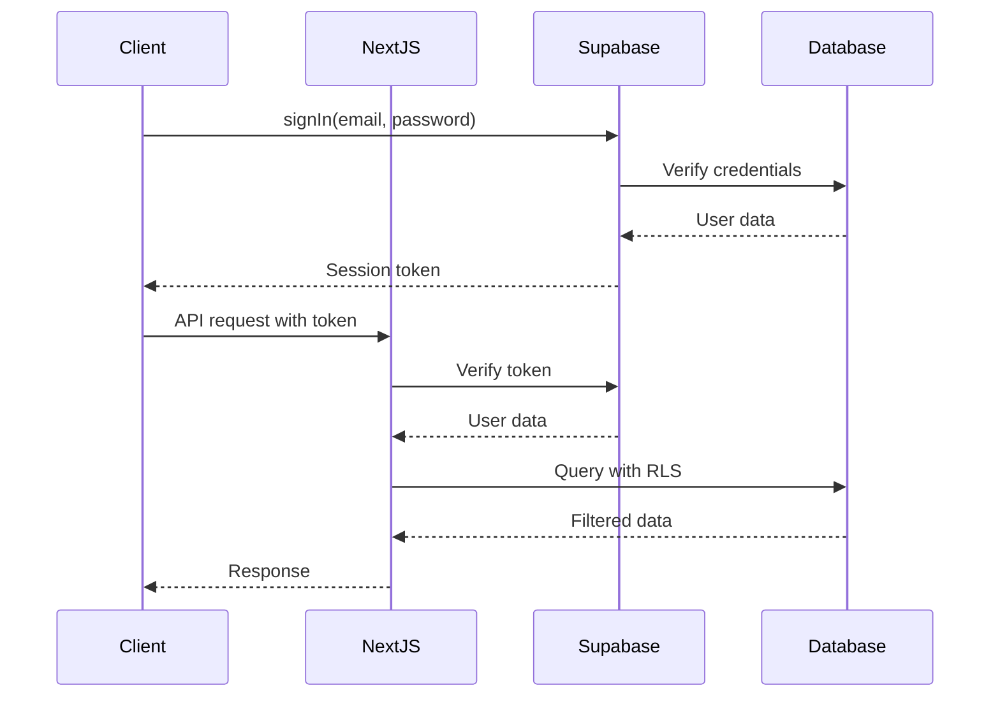

# Backend Architecture

## Service Architecture

Since we're using Next.js API routes, our backend follows a serverless pattern:

### Function Organization
```text
app/api/
├── auth/
│   └── [...supabase]/
│       └── route.ts    # Supabase auth handler
├── courses/
│   ├── route.ts        # GET, POST /api/courses
│   └── [id]/
│       └── route.ts    # GET, PUT, DELETE /api/courses/:id
├── files/
│   ├── upload/
│   │   └── route.ts    # POST /api/files/upload
│   ├── categorize/
│   │   └── route.ts    # POST /api/files/categorize
│   └── [id]/
│       └── route.ts    # GET, DELETE /api/files/:id
├── study/
│   ├── summary/
│   │   └── route.ts    # POST /api/study/summary
│   ├── flashcards/
│   │   └── route.ts    # POST /api/study/flashcards
│   └── sessions/
│       └── route.ts    # GET, POST /api/study/sessions
├── groups/
│   ├── route.ts        # GET, POST /api/groups
│   └── [id]/
│       ├── route.ts    # GET, PUT, DELETE /api/groups/:id
│       └── members/
│           └── route.ts # GET, POST /api/groups/:id/members
└── billing/
    ├── create-checkout/
    │   └── route.ts    # POST /api/billing/create-checkout
    ├── webhook/
    │   └── route.ts    # POST /api/billing/webhook
    ├── portal/
    │   └── route.ts    # POST /api/billing/portal
    └── usage/
        └── route.ts    # GET /api/billing/usage
```

### Function Template
```typescript
// app/api/courses/route.ts
import { createRouteHandlerClient } from '@supabase/auth-helpers-nextjs';
import { cookies } from 'next/headers';
import { NextResponse } from 'next/server';

export async function GET() {
  const supabase = createRouteHandlerClient({ cookies });
  
  // Check authentication
  const { data: { user } } = await supabase.auth.getUser();
  if (!user) {
    return NextResponse.json({ error: 'Unauthorized' }, { status: 401 });
  }
  
  // Fetch courses
  const { data: courses, error } = await supabase
    .from('courses')
    .select('*')
    .eq('user_id', user.id)
    .order('created_at', { ascending: false });
    
  if (error) {
    return NextResponse.json({ error: error.message }, { status: 500 });
  }
  
  return NextResponse.json(courses);
}

export async function POST(request: Request) {
  const supabase = createRouteHandlerClient({ cookies });
  const body = await request.json();
  
  // Validate input
  if (!body.name || !body.term) {
    return NextResponse.json(
      { error: 'Name and term are required' }, 
      { status: 400 }
    );
  }
  
  // Insert course
  const { data: course, error } = await supabase
    .from('courses')
    .insert([{ ...body, user_id: user.id }])
    .select()
    .single();
    
  if (error) {
    return NextResponse.json({ error: error.message }, { status: 500 });
  }
  
  return NextResponse.json(course, { status: 201 });
}

// Example billing route
// app/api/billing/usage/route.ts
export async function GET() {
  const supabase = createRouteHandlerClient({ cookies });
  const { data: { user } } = await supabase.auth.getUser();
  
  if (!user) {
    return NextResponse.json({ error: 'Unauthorized' }, { status: 401 });
  }
  
  // Get user's subscription
  const { data: subscription } = await supabase
    .from('subscriptions')
    .select('*')
    .eq('user_id', user.id)
    .single();
  
  // Get current usage
  const { data: usage } = await supabase
    .from('usage_tracking')
    .select('*')
    .eq('user_id', user.id)
    .gte('period_start', new Date().toISOString().slice(0, 7) + '-01');
  
  const limits = {
    free: { files: 10, storage: 50 * 1024 * 1024, summaries: 5 },
    student: { files: -1, storage: 5 * 1024 * 1024 * 1024, summaries: -1 },
    premium: { files: -1, storage: 50 * 1024 * 1024 * 1024, summaries: -1 }
  };
  
  return NextResponse.json({
    tier: subscription?.tier || 'free',
    limits: limits[subscription?.tier || 'free'],
    usage: usage || []
  });
}
```

## Database Architecture

### Schema Design
The schema is defined in the Database Schema section above. Key design decisions:
- UUID primary keys for all tables
- Soft deletes using CASCADE for maintaining referential integrity
- JSONB for flexible settings storage
- Proper indexes on foreign keys and commonly queried fields

### Data Access Layer
```typescript
// lib/db/repositories/course.repository.ts
import { createServerComponentClient } from '@supabase/auth-helpers-nextjs';

export class CourseRepository {
  constructor(private supabase: ReturnType<typeof createServerComponentClient>) {}
  
  async findByUser(userId: string) {
    const { data, error } = await this.supabase
      .from('courses')
      .select('*')
      .eq('user_id', userId)
      .order('term', { ascending: false });
      
    if (error) throw error;
    return data;
  }
  
  async create(course: Partial<Course>) {
    const { data, error } = await this.supabase
      .from('courses')
      .insert([course])
      .select()
      .single();
      
    if (error) throw error;
    return data;
  }
  
  async update(id: string, updates: Partial<Course>) {
    const { data, error } = await this.supabase
      .from('courses')
      .update(updates)
      .eq('id', id)
      .select()
      .single();
      
    if (error) throw error;
    return data;
  }
}
```

## Authentication and Authorization

### Auth Flow


### Middleware/Guards
```typescript
// lib/auth/withAuth.ts
import { createRouteHandlerClient } from '@supabase/auth-helpers-nextjs';
import { cookies } from 'next/headers';
import { NextResponse } from 'next/server';

export function withAuth(
  handler: (req: Request, user: User) => Promise<Response>
) {
  return async (req: Request) => {
    const supabase = createRouteHandlerClient({ cookies });
    
    const { data: { user }, error } = await supabase.auth.getUser();
    
    if (error || !user) {
      return NextResponse.json(
        { error: 'Unauthorized' },
        { status: 401 }
      );
    }
    
    return handler(req, user);
  };
}

// Usage in API route
export const GET = withAuth(async (req, user) => {
  // Handler has access to authenticated user
});

// Subscription check middleware
// lib/auth/withSubscription.ts
export function withSubscription(
  requiredTier: 'free' | 'student' | 'premium',
  feature?: string
) {
  return function (
    handler: (req: Request, user: User, subscription: Subscription) => Promise<Response>
  ) {
    return withAuth(async (req: Request, user: User) => {
      const supabase = createRouteHandlerClient({ cookies });
      
      // Get subscription
      const { data: subscription } = await supabase
        .from('subscriptions')
        .select('*')
        .eq('user_id', user.id)
        .single();
      
      const userTier = subscription?.tier || 'free';
      const tierRank = { free: 0, student: 1, premium: 2 };
      
      if (tierRank[userTier] < tierRank[requiredTier]) {
        return NextResponse.json(
          { error: 'Upgrade required', requiredTier },
          { status: 402 } // Payment Required
        );
      }
      
      // Check usage limits if feature specified
      if (feature) {
        // Check and increment usage
        const { error } = await supabase.rpc('check_and_increment_usage', {
          p_user_id: user.id,
          p_feature: feature,
          p_tier: userTier
        });
        
        if (error) {
          return NextResponse.json(
            { error: 'Usage limit exceeded' },
            { status: 429 }
          );
        }
      }
      
      return handler(req, user, subscription);
    });
  };
}
```
