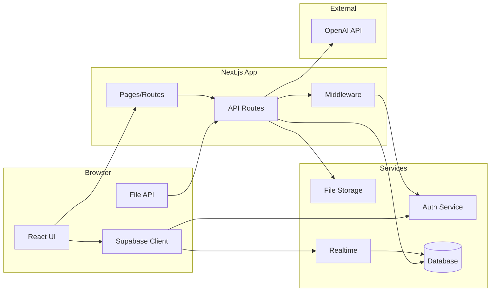

# Components

## Frontend Application
**Responsibility:** User interface, file upload handling, real-time updates, state management

**Key Interfaces:**
- File upload with progress tracking
- Real-time collaboration features
- AI result display and interaction
- Study session management

**Dependencies:** Supabase client SDK, OpenAI responses via API

**Technology Stack:** Next.js 14, React 18, TypeScript, Tailwind CSS, Shadcn/ui

## API Routes Layer
**Responsibility:** Backend logic, AI integration, data processing, file handling

**Key Interfaces:**
- REST endpoints for all operations
- File processing pipeline
- OpenAI API integration
- Supabase service calls

**Dependencies:** Supabase Admin SDK, OpenAI SDK, file parsing libraries

**Technology Stack:** Next.js API Routes, TypeScript, Node.js runtime

## Authentication Service
**Responsibility:** User authentication, session management, access control

**Key Interfaces:**
- Email/password auth
- OAuth providers (Google, GitHub)
- Magic link authentication
- Session validation

**Dependencies:** Supabase Auth

**Technology Stack:** Supabase Auth with Row Level Security

## File Storage Service
**Responsibility:** Secure file storage, access control, CDN delivery

**Key Interfaces:**
- Direct file uploads from browser
- Presigned URLs for secure access
- File metadata management
- Storage quotas

**Dependencies:** Supabase Storage

**Technology Stack:** Supabase Storage with S3-compatible API

## AI Processing Service
**Responsibility:** File categorization, summary generation, flashcard creation

**Key Interfaces:**
- Text extraction from documents
- Content analysis and categorization
- Summary generation with different lengths
- Flashcard generation from content

**Dependencies:** OpenAI API, pdf-parse, mammoth (DOCX parsing)

**Technology Stack:** OpenAI GPT-3.5/4, Next.js API routes

## Real-time Collaboration
**Responsibility:** Live updates, chat, shared whiteboards, presence

**Key Interfaces:**
- WebSocket connections
- Channel subscriptions
- Presence tracking
- Message broadcasting

**Dependencies:** Supabase Realtime

**Technology Stack:** Supabase Realtime with PostgreSQL triggers

## Payment Processing Service
**Responsibility:** Subscription management, payment processing, usage tracking

**Key Interfaces:**
- Checkout session creation
- Subscription status verification
- Usage limit enforcement
- Webhook handling for Stripe events

**Dependencies:** Stripe API, Supabase for storage

**Technology Stack:** Stripe SDK, Next.js API routes, PostgreSQL for subscription data

## Component Diagrams

