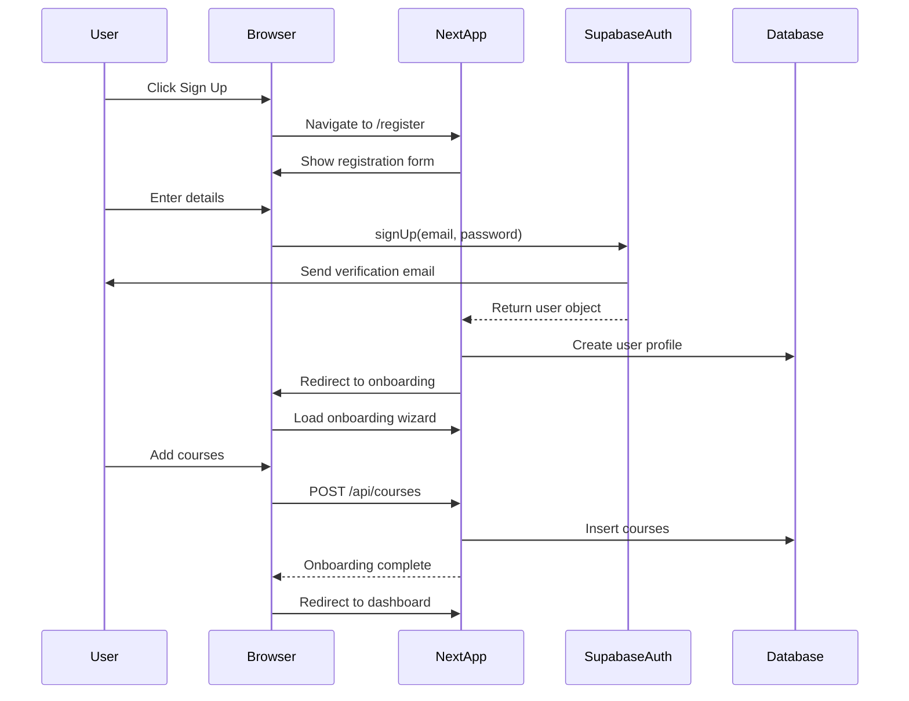
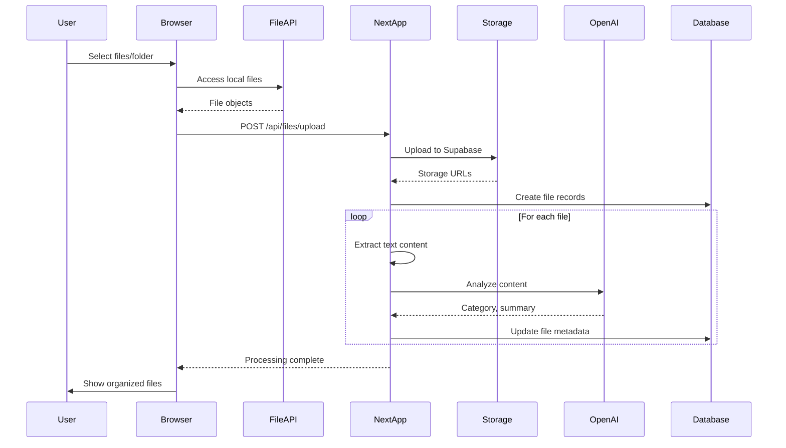
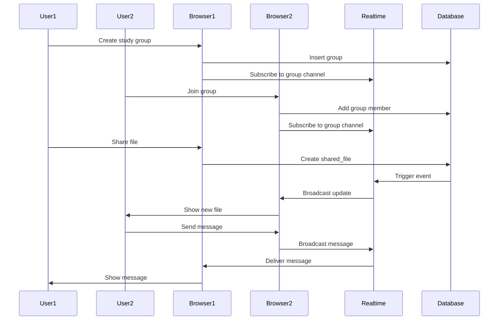

# Core Workflows

## User Registration and Onboarding

```mermaid
sequenceDiagram
    participant User
    participant Browser
    participant NextApp
    participant SupabaseAuth
    participant Database
    
    User->>Browser: Click Sign Up
    Browser->>NextApp: Navigate to /register
    NextApp->>Browser: Show registration form
    User->>Browser: Enter details
    Browser->>SupabaseAuth: signUp(email, password)
    SupabaseAuth->>User: Send verification email
    SupabaseAuth-->>NextApp: Return user object
    NextApp->>Database: Create user profile
    NextApp->>Browser: Redirect to onboarding
    Browser->>NextApp: Load onboarding wizard
    User->>Browser: Add courses
    Browser->>NextApp: POST /api/courses
    NextApp->>Database: Insert courses
    NextApp-->>Browser: Onboarding complete
    Browser->>NextApp: Redirect to dashboard
```

## File Upload and AI Processing

```mermaid
sequenceDiagram
    participant User
    participant Browser
    participant FileAPI
    participant NextApp
    participant Storage
    participant OpenAI
    participant Database
    
    User->>Browser: Select files/folder
    Browser->>FileAPI: Access local files
    FileAPI-->>Browser: File objects
    Browser->>NextApp: POST /api/files/upload
    NextApp->>Storage: Upload to Supabase
    Storage-->>NextApp: Storage URLs
    NextApp->>Database: Create file records
    
    loop For each file
        NextApp->>NextApp: Extract text content
        NextApp->>OpenAI: Analyze content
        OpenAI-->>NextApp: Category, summary
        NextApp->>Database: Update file metadata
    end
    
    NextApp-->>Browser: Processing complete
    Browser->>User: Show organized files
```

## Real-time Collaboration

```mermaid
sequenceDiagram
    participant User1
    participant User2
    participant Browser1
    participant Browser2
    participant Realtime
    participant Database
    
    User1->>Browser1: Create study group
    Browser1->>Database: Insert group
    Browser1->>Realtime: Subscribe to group channel
    
    User2->>Browser2: Join group
    Browser2->>Database: Add group member
    Browser2->>Realtime: Subscribe to group channel
    
    User1->>Browser1: Share file
    Browser1->>Database: Create shared_file
    Database->>Realtime: Trigger event
    Realtime->>Browser2: Broadcast update
    Browser2->>User2: Show new file
    
    User2->>Browser2: Send message
    Browser2->>Realtime: Broadcast message
    Realtime->>Browser1: Deliver message
    Browser1->>User1: Show message
```
