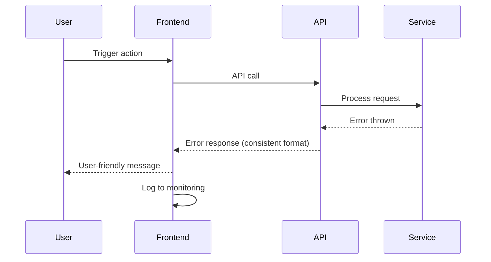

# Error Handling Strategy

## Error Flow


## Error Response Format
```typescript
interface ApiError {
  error: {
    code: string;
    message: string;
    details?: Record<string, any>;
    timestamp: string;
    requestId: string;
  };
}
```

## Frontend Error Handling
```typescript
// lib/errors/handler.ts
export async function handleApiError(error: unknown): Promise<void> {
  if (error instanceof ApiError) {
    // Show user-friendly message
    toast.error(getErrorMessage(error.code));
    
    // Log to monitoring
    console.error('API Error:', error);
  } else {
    // Generic error
    toast.error('Something went wrong. Please try again.');
  }
}

// Usage in component
try {
  await filesService.upload(files);
} catch (error) {
  await handleApiError(error);
}
```

## Backend Error Handling
```typescript
// lib/errors/api-error.ts
export class ApiError extends Error {
  constructor(
    public code: string,
    public message: string,
    public statusCode: number,
    public details?: any
  ) {
    super(message);
  }
}

// lib/errors/handler.ts
export function errorHandler(error: unknown): Response {
  if (error instanceof ApiError) {
    return NextResponse.json(
      {
        error: {
          code: error.code,
          message: error.message,
          details: error.details,
          timestamp: new Date().toISOString(),
          requestId: crypto.randomUUID(),
        },
      },
      { status: error.statusCode }
    );
  }
  
  // Generic error
  return NextResponse.json(
    {
      error: {
        code: 'INTERNAL_ERROR',
        message: 'An unexpected error occurred',
        timestamp: new Date().toISOString(),
        requestId: crypto.randomUUID(),
      },
    },
    { status: 500 }
  );
}
```
