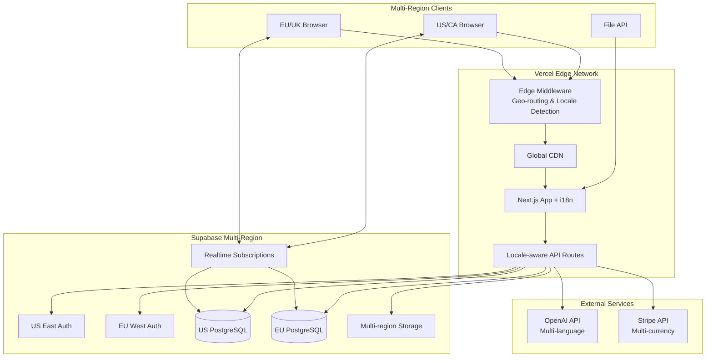

# High Level Architecture

## Technical Summary
CourseFlow uses a monolithic Next.js 14 application with internationalization support deployed across multiple Vercel regions, leveraging Supabase as a complete backend-as-a-service solution. The architecture follows the Jamstack pattern with locale-aware server-side rendering for optimal performance, while API routes handle all backend logic including OpenAI integration for multilingual AI features. Authentication, database, file storage, and real-time features are all managed through Supabase with multi-region replication. The system supports 4+ languages (English, French, German, Spanish), multiple currencies (USD, CAD, EUR, GBP), and diverse academic systems (GPA, ECTS, UK Honours). This approach enables rapid development while serving a total addressable market of ~50 million students across target regions.

## Platform and Infrastructure Choice
**Platform:** Vercel + Supabase  
**Key Services:** 
- Vercel: Hosting, CDN, Edge Functions, Analytics
- Supabase: PostgreSQL, Auth, Storage, Realtime
- Stripe: Payment processing, subscription management
- OpenAI API: GPT-3.5/4 for AI features
**Deployment Host and Regions:** 
- Primary: Vercel Global Edge Network with regional deployments
- US East (Virginia) - Primary for North America
- EU West (Frankfurt) - Primary for Europe
- Edge middleware for geo-routing and locale detection
- Supabase regions aligned with Vercel deployments

## Repository Structure
**Structure:** Monorepo using npm workspaces  
**Monorepo Tool:** npm workspaces (built into npm 7+)  
**Package Organization:** Single Next.js app with shared types package

## High Level Architecture Diagram

## Architectural Patterns
- **Jamstack Architecture:** Static generation with dynamic API routes - *Rationale:* Optimal performance and SEO for content-heavy academic platform
- **Monolithic Deployment:** Single Next.js app handles everything - *Rationale:* Drastically reduces complexity for 10-week MVP timeline
- **Backend-for-Frontend (BFF):** API routes tailored for frontend needs - *Rationale:* Eliminates over-fetching and simplifies state management
- **Component-Based UI:** Reusable React components with TypeScript - *Rationale:* Rapid development with type safety
- **Server Components:** React Server Components for data fetching - *Rationale:* Reduces client bundle size and improves performance
- **Row Level Security:** Database-level access control - *Rationale:* Security enforced at data layer, not application layer
- **Multi-Region Deployment:** Separate deployments for NA and EU - *Rationale:* Data residency compliance and performance
- **Locale-First Routing:** All routes prefixed with locale - *Rationale:* SEO optimization and user experience
