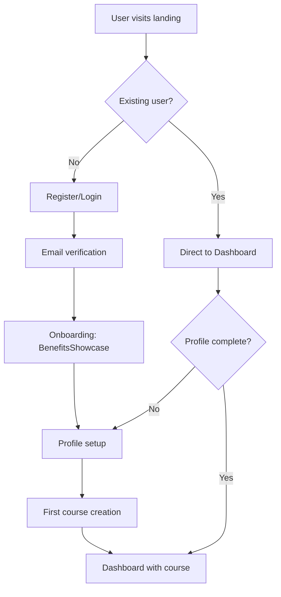
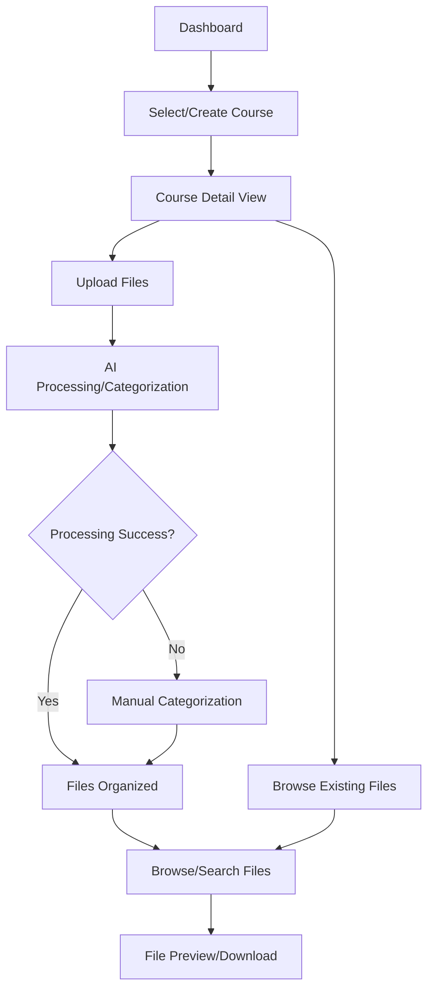

# CourseFlow UI/UX Specification

This document defines the user experience goals, information architecture, user flows, and visual design specifications for CourseFlow's user interface. It serves as the foundation for visual design and frontend development, ensuring a cohesive and user-centered experience.

## Introduction

**Document Purpose:** This specification establishes a cohesive design system that extends the successful BenefitsShowcase aesthetic throughout the entire CourseFlow application, replacing problematic lime green backgrounds and poor contrast ratios with a modern, accessible, salmon/coral-based design system.

**Key Issues Addressed:**
- **Critical:** Replace terrible `bg-[#ECF0C0]` lime green dashboard background
- **High Priority:** Fix contrast ratios failing WCAG standards
- **Design System:** Create consistency between landing page and dashboard themes
- **User Experience:** Improve visual hierarchy and component cohesion

### Overall UX Goals & Principles

#### Target User Personas
- **Academic Students:** Primary users who need efficient study material organization and access
- **Power Users:** Students with heavy course loads requiring advanced features and bulk operations
- **Casual Users:** Occasional users who prioritize ease of use and clear guidance

#### Usability Goals
- **Ease of learning:** New users can complete core tasks (course creation, file upload) within 5 minutes
- **Efficiency of use:** Frequent users can upload and organize files with minimal clicks
- **Error prevention:** Clear validation and confirmation for destructive actions
- **Visual clarity:** Eliminate contrast issues and improve readability throughout

#### Design Principles
1. **Clarity over cleverness** - Prioritize clear communication over aesthetic innovation
2. **Progressive disclosure** - Show only what's needed, when it's needed
3. **Consistent patterns** - Use familiar UI patterns throughout the application
4. **Immediate feedback** - Every action should have a clear, immediate response
5. **Accessible by default** - Design for all users from the start

## Information Architecture (IA)

### Site Map / Screen Inventory

```mermaid
graph TD
    A[Landing Page /] --> B[Authentication /(auth)]
    A --> L[Help /help]
    
    B --> B1[Login]
    B --> B2[Register] 
    B --> B3[Reset Password]
    
    B --> C[Onboarding /onboarding]
    C --> D[Main Dashboard /dashboard]
    
    D --> E[Course Management]
    D --> F[Analytics & Reports]
    D --> G[User Functions]
    
    E --> E1[Course List /dashboard]
    E --> E2[Course Details /dashboard/courses/courseId]
    E --> E3[Search /dashboard/search]
    
    F --> F1[Stats /dashboard/stats]
    F --> F2[Analytics /dashboard/analytics] 
    F3[Achievements /dashboard/achievements]
    F --> F3
    
    G --> G1[Notifications /dashboard/notifications]
    G --> G2[Settings Hub /settings]
    
    G2 --> G2a[Profile /settings/profile]
    G2 --> G2b[Country /settings/country]
    G2 --> G2c[Privacy /settings/privacy]
    
    %% Alternative course routes
    H[Direct Course Access /courses] --> H1[Course View /courses/id]
    H1 --> H2[Course Settings /courses/id/settings]
```

### Navigation Structure

**Primary Navigation:** Persistent sidebar with main sections (Dashboard, Courses, Files, Analytics, Profile)

**Secondary Navigation:** Contextual tabs within each main section

**Breadcrumb Strategy:** Show path hierarchy for deep navigation (Course > Files > Category)

## User Flows

### Flow 1: New User Onboarding → Dashboard Setup
**User Goal:** Get from registration to productive use of CourseFlow  
**Entry Points:** Landing page CTA, direct signup link  
**Success Criteria:** User reaches dashboard with at least one course created

#### Flow Diagram


#### Edge Cases & Error Handling:
- Email verification timeout → Resend verification flow
- Incomplete profile → Redirect to profile completion
- Failed course creation → Show error state with retry option
- Slow onboarding → Skip option with later completion prompt

### Flow 2: Course & File Management Workflow
**User Goal:** Upload, organize, and access study materials efficiently  
**Entry Points:** Dashboard course cards, direct file upload  
**Success Criteria:** Files successfully categorized and accessible

#### Flow Diagram


#### Edge Cases & Error Handling:
- Large file upload failure → Chunked upload with progress
- AI processing timeout → Fallback to manual categorization
- File format not supported → Clear error with supported formats
- Storage quota exceeded → Upgrade prompt with usage visualization

## Wireframes & Mockups

**Primary Design Files:** Direct implementation in existing component structure with complete redesign specifications

### Key Screen Layouts

#### **Dashboard Landing (CRITICAL FIX)**
**Purpose:** Replace the terrible lime green background with cohesive salmon/coral theme
**Key Elements:**
- Hero section with course overview cards
- Quick actions toolbar (Add Course, Upload Files, View Analytics)
- Recent activity feed
- Progress indicators with proper contrast

**Interaction Notes:** Hover animations like BenefitsShowcase, smooth transitions

#### **Course Detail View**
**Purpose:** Comprehensive course management with file organization
**Key Elements:**
- Course header with metadata (professor, term, credits)
- File categories with visual indicators
- Upload dropzone with progress feedback
- File list with preview capabilities

**Interaction Notes:** Drag-and-drop file organization, expandable categories

#### **File Upload Interface**
**Purpose:** Seamless file upload with AI processing feedback
**Key Elements:**
- Multi-file drop zone with visual feedback
- Upload progress with descriptive states
- AI categorization preview
- Error handling with retry options

**Interaction Notes:** Real-time progress, smooth state transitions

#### **Navigation Layout**
**Purpose:** Consistent navigation across all dashboard pages
**Key Elements:**
- Persistent sidebar with clear visual hierarchy
- Breadcrumb navigation for deep pages
- User profile dropdown with logout
- Theme toggle integration

**Interaction Notes:** Responsive collapse, active state indicators

## Component Library / Design System

**Design System Approach:** Complete redesign extending Shadcn/ui foundation with cohesive CourseFlow design system that eliminates visual inconsistencies.

### Core Components

#### **CourseCard (Enhanced)**
**Purpose:** Primary course representation with consistent theming
**Variants:** Default, Compact, Interactive
**States:** Default, Hover, Loading, Error, Selected
**Usage Guidelines:** Always use consistent color system, maintain 4.5:1 contrast ratio

#### **DashboardLayout (CRITICAL)**
**Purpose:** Replace lime green nightmare with cohesive background system
**Variants:** Standard, Academic, Landing
**States:** Loading skeleton, Error boundary, Success
**Usage Guidelines:** NEVER use `bg-[#ECF0C0]` - use theme-consistent backgrounds

#### **FileUpload (Enhanced)**
**Purpose:** Improved upload experience with better visual feedback
**Variants:** Dropzone, Button, Progress
**States:** Idle, Dragging, Uploading, Processing, Success, Error
**Usage Guidelines:** Always show progress, provide clear error messages

#### **NavigationSidebar**
**Purpose:** Consistent navigation across all dashboard pages
**Variants:** Expanded, Collapsed, Mobile
**States:** Active section, Hover, Collapsed
**Usage Guidelines:** Maintain visual hierarchy, use consistent theming

#### **Button System (Standardized)**
**Purpose:** Unified button styling across the application
**Variants:** Primary, Secondary, Ghost, Destructive
**States:** Default, Hover, Active, Disabled, Loading
**Usage Guidelines:** Use primary sparingly, maintain consistent sizing

#### **ColorThemeProvider**
**Purpose:** Centralized theme management
**Variants:** Light, Dark, High Contrast
**States:** Theme switching transitions
**Usage Guidelines:** Replace academic-theme inconsistencies

## Branding & Style Guide

### Visual Identity
**Brand Guidelines:** Extend successful landing page salmon/coral identity throughout the entire application

### Color Palette

| Color Type | Hex Code | RGB | Usage |
|------------|----------|-----|--------|
| Primary | #FA8072 | 250, 128, 114 | Primary CTAs, active states, brand elements |
| Primary Light | #FFB6B0 | 255, 182, 176 | Hover states, light backgrounds |
| Secondary | #FF6B6B | 255, 107, 107 | Secondary actions, highlights |
| Accent | #FFF5F5 | 255, 245, 245 | Card backgrounds, light areas |
| Success | #10B981 | 16, 185, 129 | Success states, confirmations |
| Warning | #F59E0B | 245, 158, 11 | Warnings, cautions |
| Error | #EF4444 | 239, 68, 68 | Errors, destructive actions |
| Neutral Gray | #6B7280 | 107, 114, 128 | Text, borders, subtle elements |
| Background | #FEFEFE | 254, 254, 254 | Main app background (NO MORE LIME GREEN!) |
| Card | #FFFFFF | 255, 255, 255 | Card/component backgrounds |

### Typography

#### Font Families
- **Primary:** Inter (already configured) - Clean, modern, excellent readability
- **Secondary:** System fonts fallback for performance
- **Monospace:** JetBrains Mono (for code/technical content)

#### Type Scale
| Element | Size | Weight | Line Height |
|---------|------|--------|-------------|
| H1 | 2.25rem (36px) | 700 (Bold) | 1.2 |
| H2 | 1.875rem (30px) | 600 (Semibold) | 1.3 |
| H3 | 1.5rem (24px) | 600 (Semibold) | 1.4 |
| Body | 1rem (16px) | 400 (Regular) | 1.5 |
| Small | 0.875rem (14px) | 400 (Regular) | 1.4 |

### Iconography
**Icon Library:** Lucide React (already in use) - consistent style, excellent variety

**Usage Guidelines:** 
- Standard size: 20px for UI elements, 24px for headers
- Always use consistent stroke width (2px)
- Maintain semantic consistency (same icon for same action)

### Spacing & Layout
**Grid System:** 12-column responsive grid with consistent breakpoints
**Spacing Scale:** 4px base unit (4, 8, 12, 16, 24, 32, 48, 64px)

## Accessibility Requirements

### Compliance Target
**Standard:** WCAG 2.1 AA compliance with enhanced focus on color contrast

### Key Requirements

**Visual:**
- **Color contrast ratios:** Minimum 4.5:1 for normal text, 3:1 for large text (24px+)
- **Focus indicators:** 2px solid primary color outline with 2px offset on all interactive elements
- **Text sizing:** Support up to 200% zoom without horizontal scrolling, minimum 16px base size

**Interaction:**
- **Keyboard navigation:** Full tab order through all interactive elements, skip links for main content
- **Screen reader support:** Proper ARIA labels, semantic HTML structure, live regions for dynamic content
- **Touch targets:** Minimum 44px touch target size for mobile interactions

**Content:**
- **Alternative text:** Descriptive alt text for all images, icons, and visual content
- **Heading structure:** Logical heading hierarchy (H1→H2→H3) for screen readers
- **Form labels:** Explicit labels for all form inputs with error state announcements

### Testing Strategy
- **Automated:** ESLint accessibility plugin, Lighthouse accessibility audits
- **Manual:** Keyboard-only navigation testing, screen reader testing with NVDA/JAWS
- **User Testing:** Include users with disabilities in design validation

## Responsiveness Strategy

### Breakpoints

| Breakpoint | Min Width | Max Width | Target Devices |
|------------|-----------|-----------|----------------|
| Mobile | 320px | 767px | Phones, small tablets |
| Tablet | 768px | 1023px | iPads, medium tablets |
| Desktop | 1024px | 1439px | Laptops, small monitors |
| Wide | 1440px | - | Large monitors, ultrawide displays |

### Adaptation Patterns

**Layout Changes:** 
- Mobile: Single column stack, collapsible sidebar becomes bottom nav
- Tablet: Two-column layout with sidebar overlay
- Desktop: Full three-column layout with persistent sidebar
- Wide: Expanded content areas with larger cards and more whitespace

**Navigation Changes:**
- Mobile: Bottom navigation bar with essential items, hamburger menu for secondary
- Tablet: Collapsible sidebar with icon + text labels
- Desktop+: Persistent sidebar with full navigation hierarchy

**Content Priority:**
- Mobile: Hide secondary information, focus on primary actions
- Tablet: Show abbreviated metadata, collapsible details
- Desktop+: Full information display with rich interactions

**Interaction Changes:**
- Mobile: Touch-optimized 44px+ targets, swipe gestures for file management
- Tablet: Mixed touch/pointer interactions, context menus
- Desktop: Hover states, keyboard shortcuts, right-click menus

## Animation & Micro-interactions

### Motion Principles
- **Purposeful:** Every animation serves a functional purpose (feedback, guidance, or delight)
- **Performant:** 60fps animations using CSS transforms and opacity changes
- **Respectful:** Honor prefers-reduced-motion for accessibility
- **Consistent:** Unified timing and easing throughout the application

### Key Animations

- **Page Transitions:** Smooth fade-in with slight upward movement (Duration: 300ms, Easing: ease-out)
- **Card Hover Effects:** Subtle lift with shadow increase (Duration: 200ms, Easing: cubic-bezier(0.4, 0, 0.2, 1))
- **File Upload Progress:** Smooth progress bar with pulse on processing (Duration: Variable, Easing: linear)
- **Button Interactions:** Scale down on press, scale back with slight bounce (Duration: 150ms, Easing: ease-out)
- **Sidebar Collapse:** Width transition with content fade (Duration: 250ms, Easing: ease-in-out)
- **Form Validation:** Shake animation for errors, checkmark for success (Duration: 400ms, Easing: ease-out)
- **Course Card Floating:** Subtle continuous float on hover (Duration: 2s, Easing: ease-in-out infinite)
- **Loading States:** Shimmer effect for content placeholders (Duration: 1.5s, Easing: linear infinite)
- **Modal Entrance:** Scale from 0.95 to 1.0 with opacity fade (Duration: 200ms, Easing: ease-out)
- **Notification Toast:** Slide in from top-right with bounce settle (Duration: 350ms, Easing: spring)

## Performance Considerations

### Performance Goals
- **Page Load:** <2s initial load, <500ms subsequent page transitions
- **Interaction Response:** <100ms for immediate feedback, <300ms for complex operations  
- **Animation FPS:** Consistent 60fps with graceful degradation on low-end devices

### Design Strategies
- **Lazy Loading:** Progressive image loading with blur-to-sharp transitions for course thumbnails and file previews
- **Skeleton States:** Immediate visual feedback during data loading with content-aware placeholders
- **Optimistic Updates:** Instant UI updates for user actions with rollback on failure
- **Bundle Optimization:** Code splitting by route with preloading for likely next pages
- **Asset Management:** WebP images with fallbacks, compressed SVG icons, minimal external fonts

## Next Steps

### Immediate Actions

1. **Create comprehensive component redesign specifications** - Document each dashboard component with new styling requirements
2. **Establish new design system implementation plan** - Define priority order for component updates
3. **Set up development environment for complete redesign** - Configure new theme variables and component architecture
4. **Create design review process** - Establish approval workflow for new components before implementation
5. **Plan phased rollout strategy** - Determine which sections get redesigned first (Dashboard → Courses → Files → Analytics)

### Design Handoff Checklist

- [x] All user flows documented
- [x] Component inventory complete  
- [x] Accessibility requirements defined
- [x] Responsive strategy clear
- [x] Brand guidelines incorporated
- [x] Performance goals established

---

*This specification provides the foundation for a complete CourseFlow redesign that eliminates current UI/UX problems and creates a cohesive, accessible, modern academic file management experience.*